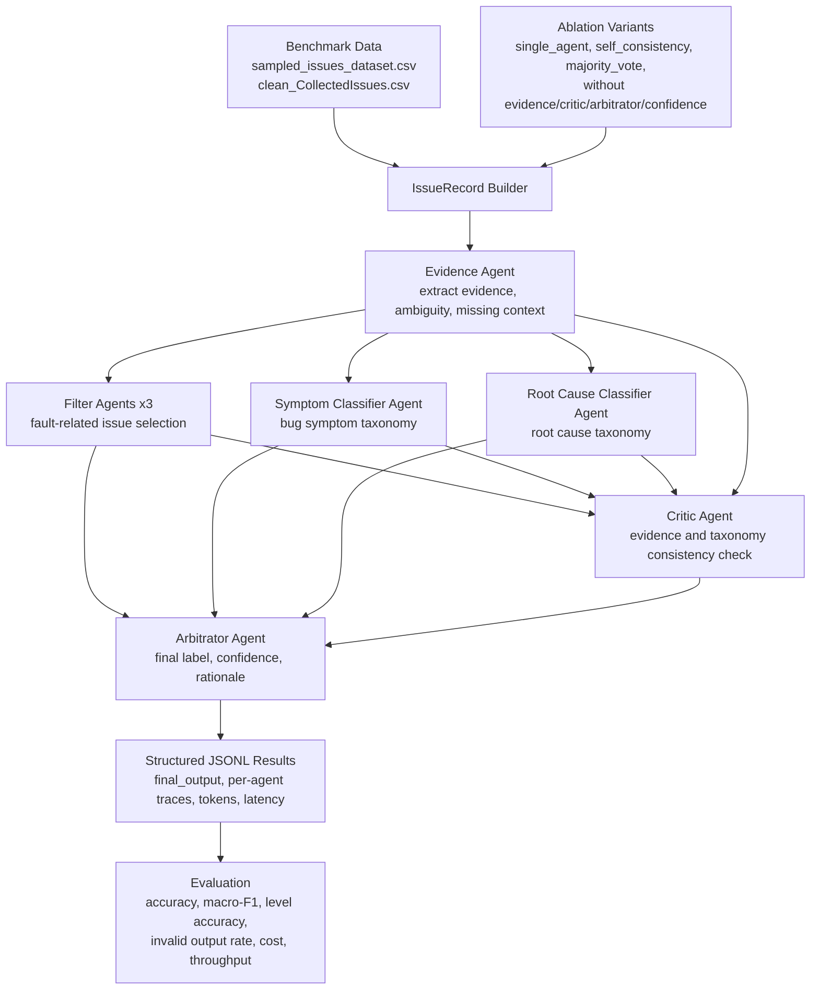

# AutoEmpirical MAS

This repository contains the original AutoEmpirical reproduction artifacts plus
a new multi-agent-system experiment framework for turning the short benchmark
study into a benchmark-plus-method paper.

## What Changed

- `autoempirical_mas/` implements a reliability-oriented MAS workflow.
- `run_mas_experiment.py` runs single-agent, voting, ablation, and full-MAS variants.
- `evaluate_mas_results.py` evaluates task quality and efficiency from JSONL outputs.
- Credentials are loaded from environment variables or `.env`; API keys are no longer hard-coded in scripts.

## MAS Roles

- `Evidence Agent`: extracts issue evidence without making labels.
- `Filter Agent`: classifies issue reports as `Accepted` or `Rejected`.
- `Symptom Classifier Agent`: focuses on observable bug symptoms.
- `Root Cause Classifier Agent`: focuses on underlying root causes.
- `Critic Agent`: checks consistency against evidence and taxonomy definitions.
- `Arbitrator Agent`: fuses candidates into the final structured decision.

## MAS Framework



## Experiment Variants

- `single_agent`
- `self_consistency`
- `majority_vote`
- `mas_without_evidence`
- `mas_without_critic`
- `mas_without_arbitrator`
- `mas_without_confidence`
- `full_mas`

These variants directly support the planned RQs about MAS performance,
efficiency, and ablation of each design contribution.

## Setup

Install dependencies:

```powershell
pip install -r requirements.txt
```

Create a local `.env` from `.env.example` and fill in the keys needed by your
backend:

```powershell
Copy-Item .env.example .env
```

The `.env` file is ignored by git.

## Run Experiments

Offline smoke test with the mock backend:

```powershell
python run_mas_experiment.py --task filtering --variant full_mas --backend mock --model mock --limit 5
python evaluate_mas_results.py --task filtering --predictions res/mas_filtering_full_mas_mock.jsonl
```

Run the full MAS with an OpenAI-compatible backend:

```powershell
python run_mas_experiment.py --task filtering --variant full_mas --backend openai --model gpt-4o-mini
python run_mas_experiment.py --task classification --variant full_mas --backend openai --model gpt-4o-mini
```

Run through CAMEL-AI role agents:

```powershell
python run_mas_experiment.py --task classification --variant full_mas --backend camel --model gpt-4o-mini
```

Evaluate:

```powershell
python evaluate_mas_results.py --task filtering --predictions res/mas_filtering_full_mas_gpt-4o-mini.jsonl
python evaluate_mas_results.py --task classification --predictions res/mas_classification_full_mas_gpt-4o-mini.jsonl
```

## Data

- Filtering benchmark: `data/sampled_issues_dataset.csv`
- Classification benchmark: `data/clean_CollectedIssues.csv`
- Existing baseline outputs: `res/Filteration_*.csv` and `res/Labeling_*.csv`

## Phase-1 Dataset Construction

The phase-1 dataset pipeline turns the empirical bug-study collection workbook
into a machine-readable source manifest, converts local seed datasets into a
shared bug-report schema, deduplicates records, and writes reproducible summary
tables.

Build the current offline dataset:

```powershell
python scripts/build_phase1_dataset.py
```

Generated artifacts:

- `data/manifest/dataset_sources.csv`: 52-paper source manifest from
  `Attachments/AutoEmpirical-Dataset-Collection.xlsx`.
- `data/interim/<source>/records.csv`: per-source converted records.
- `data/processed/autoempirical_bug_dataset.csv`: unified phase-1 dataset.
- `data/processed/data_dictionary.md`: schema and field definitions.
- `data/processed/quality_report.md`: build summary, validation notes, and
  source status counts.
- `data/processed/summary.csv` and `records_by_*.csv`: analysis-ready summary
  tables.

The first build uses the TensorFlow.js/JavaScript DL local seed data already in
this repository. Other papers from the workbook are registered as pending or
deferred in the manifest until their raw datasets are downloaded, licensed, and
given a converter.

Check and download phase-1 raw sources:

```powershell
python scripts/download_phase1_sources.py --dry-run
python scripts/download_phase1_sources.py --categories auto_direct --limit 2
python scripts/download_phase1_sources.py --source-indexes 7,8,30
```

The downloader writes raw files under `data/raw/<paper_id>/`, records every
attempt in `data/manifest/download_status.csv`, and lists manual follow-ups in
`data/manifest/manual_download_needed.csv`. It prints per-source progress by
default, skips existing files instead of overwriting them, and treats large or
ambiguous sources as manual follow-ups. Add `--quiet` only if you want to
suppress the progress log.

If GitHub returns `HTTP Error 403: rate limit exceeded`, wait for the anonymous
API limit to reset or set a GitHub token before rerunning:

```powershell
$env:GITHUB_TOKEN="your_token_here"
python scripts/download_phase1_sources.py --categories auto_repo_or_dir
```

You can also retry smaller batches:

```powershell
python scripts/download_phase1_sources.py --categories auto_repo_or_dir --source-indexes 4,5,6
```

## Notes

- The deterministic orchestration and ablation logic live in this repository so
  results are reproducible across backends.
- CAMEL-AI is used as an optional role-agent backend; the same MAS protocol can
  also run through OpenAI-compatible APIs for cost and compatibility experiments.
- Result files are JSONL so failed samples, invalid JSON, token usage, latency,
  and per-agent traces can be audited later.
