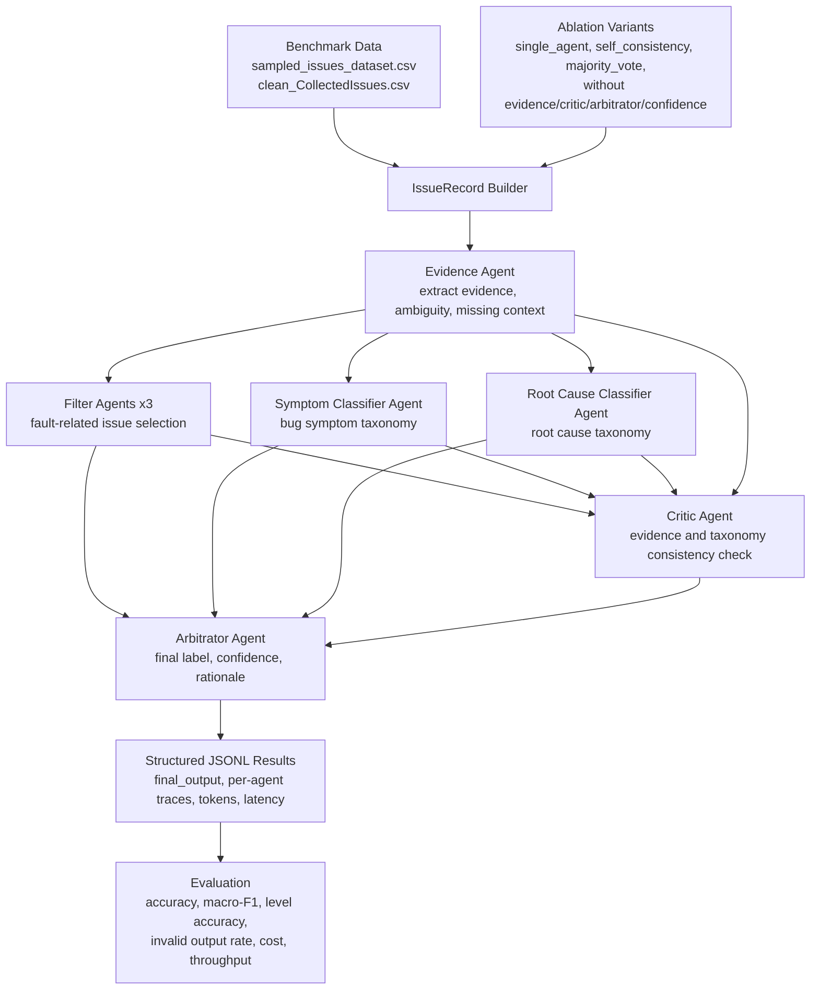

# AutoEmpirical Reproduction and Stage-1 Dataset

This repository contains the original AutoEmpirical reproduction artifacts, a
multi-agent-system experiment framework, and a new Stage-1 data construction
pipeline for manually labeled empirical bug datasets.

The latest additions focus on turning raw paper artifacts into a unified,
analysis-ready table of bug records with explicit labels such as `symptom`,
`root_cause`, `bug_type`, `component`, and `fix_type`.

## What Changed

- `autoempirical_mas/` implements a reliability-oriented MAS workflow.
- `run_mas_experiment.py` runs single-agent, voting, ablation, and full-MAS variants.
- `evaluate_mas_results.py` evaluates task quality and efficiency from JSONL outputs.
- Credentials are loaded from environment variables or `.env`; API keys are no longer hard-coded in scripts.
- `data/manifest/manual_checklist.csv` records which paper datasets exist in
  `data/raw/` and which raw datasets passed manual inspection.
- `scripts/prepare_stage1_raw.py` copies manually verified raw datasets into
  `data/raw_stage1/` without modifying the original `data/raw/` directory.
- `scripts/redownload_stage1_candidates.py` supports isolated re-download
  attempts for problematic raw sources and only accepts candidate tables that
  contain both symptom-like and root-cause-like fields.
- `autoempirical_dataset/stage1_converters.py` converts verified Stage-1 raw
  datasets into a shared flat label schema.
- `scripts/build_stage1_unified_dataset.py` builds the final Stage-1 unified
  label table and conversion report.
- `notebooks/stage1_visual_analysis.ipynb` provides visual analysis of root
  causes, symptoms, sources, bug types, components, and fix types.

## MAS Roles

- `Evidence Agent`: extracts issue evidence without making labels.
- `Filter Agent`: classifies issue reports as `Accepted` or `Rejected`.
- `Symptom Classifier Agent`: focuses on observable bug symptoms.
- `Root Cause Classifier Agent`: focuses on underlying root causes.
- `Critic Agent`: checks consistency against evidence and taxonomy definitions.
- `Arbitrator Agent`: fuses candidates into the final structured decision.

## MAS Framework



## Experiment Variants

- `single_agent`
- `self_consistency`
- `majority_vote`
- `mas_without_evidence`
- `mas_without_critic`
- `mas_without_arbitrator`
- `mas_without_confidence`
- `full_mas`

These variants directly support the planned RQs about MAS performance,
efficiency, and ablation of each design contribution.

## Setup

Install dependencies:

```powershell
pip install -r requirements.txt
```

Create a local `.env` from `.env.example` and fill in the keys needed by your
backend:

```powershell
Copy-Item .env.example .env
```

The `.env` file is ignored by git.

## Run Experiments

Offline smoke test with the mock backend:

```powershell
python run_mas_experiment.py --task filtering --variant full_mas --backend mock --model mock --limit 5
python evaluate_mas_results.py --task filtering --predictions res/mas_filtering_full_mas_mock.jsonl
```

Run the full MAS with an OpenAI-compatible backend:

```powershell
python run_mas_experiment.py --task filtering --variant full_mas --backend openai --model gpt-4o-mini
python run_mas_experiment.py --task classification --variant full_mas --backend openai --model gpt-4o-mini
```

Run through CAMEL-AI role agents:

```powershell
python run_mas_experiment.py --task classification --variant full_mas --backend camel --model gpt-4o-mini
```

Evaluate:

```powershell
python evaluate_mas_results.py --task filtering --predictions res/mas_filtering_full_mas_gpt-4o-mini.jsonl
python evaluate_mas_results.py --task classification --predictions res/mas_classification_full_mas_gpt-4o-mini.jsonl
```

## Data

- Filtering benchmark: `data/sampled_issues_dataset.csv`
- Classification benchmark: `data/clean_CollectedIssues.csv`
- Existing baseline outputs: `res/Filteration_*.csv` and `res/Labeling_*.csv`
- Stage-1 manually verified raw data: `data/raw_stage1/`
- Stage-1 converted per-paper records: `data/interim/stage1_converted/`
- Stage-1 unified labels: `data/processed/stage1_unified_labels.csv`
- Stage-1 visual analysis outputs: `data/processed/stage1_visuals/`

## Phase-1 Dataset Construction

The phase-1 dataset pipeline turns the empirical bug-study collection workbook
into a machine-readable source manifest, converts local seed datasets into a
shared bug-report schema, deduplicates records, and writes reproducible summary
tables.

Build the current offline dataset:

```powershell
python scripts/build_phase1_dataset.py
```

Generated artifacts:

- `data/manifest/dataset_sources.csv`: 52-paper source manifest from
  `Attachments/AutoEmpirical-Dataset-Collection.xlsx`.
- `data/interim/<source>/records.csv`: per-source converted records.
- `data/processed/autoempirical_bug_dataset.csv`: unified phase-1 dataset.
- `data/processed/data_dictionary.md`: schema and field definitions.
- `data/processed/quality_report.md`: build summary, validation notes, and
  source status counts.
- `data/processed/summary.csv` and `records_by_*.csv`: analysis-ready summary
  tables.

The first build uses the TensorFlow.js/JavaScript DL local seed data already in
this repository. Other papers from the workbook are registered as pending or
deferred in the manifest until their raw datasets are downloaded, licensed, and
given a converter.

Check and download phase-1 raw sources:

```powershell
python scripts/download_phase1_sources.py --dry-run
python scripts/download_phase1_sources.py --categories auto_direct --limit 2
python scripts/download_phase1_sources.py --source-indexes 7,8,30
```

The downloader writes raw files under `data/raw/<paper_id>/`, records every
attempt in `data/manifest/download_status.csv`, and lists manual follow-ups in
`data/manifest/manual_download_needed.csv`. It prints per-source progress by
default, skips existing files instead of overwriting them, and treats large or
ambiguous sources as manual follow-ups. Add `--quiet` only if you want to
suppress the progress log.

If GitHub returns `HTTP Error 403: rate limit exceeded`, wait for the anonymous
API limit to reset or set a GitHub token before rerunning:

```powershell
$env:GITHUB_TOKEN="your_token_here"
python scripts/download_phase1_sources.py --categories auto_repo_or_dir
```

You can also retry smaller batches:

```powershell
python scripts/download_phase1_sources.py --categories auto_repo_or_dir --source-indexes 4,5,6
```

## Stage-1 Raw Dataset Preparation

Stage-1 starts from the paper-level manifest and manual checklist. The goal is
to isolate only the raw datasets that appear to contain manually labeled bug
records with both symptom and root-cause information.

Prepare the verified Stage-1 raw directory:

```powershell
python scripts/prepare_stage1_raw.py
```

This script:

- reads `data/manifest/manual_checklist.csv`;
- creates `data/raw_stage1/` and `data/manifest/stage1/`;
- copies only records marked as both `is_manual_checked_OK=true` and
  `is_existing_in_raw=true`;
- writes `data/manifest/stage1/stage1_accepted.csv`;
- writes `data/manifest/stage1/stage2_missing_raw.csv` for sources missing
  from `data/raw/`;
- skips existing target files instead of overwriting them.

Problematic raw sources can be retried in an isolated candidate directory:

```powershell
python scripts/redownload_stage1_candidates.py
```

The re-download script writes only to `data/raw_stage1_candidates/`. It does
not modify `data/raw/` or `data/raw_stage1/`. Candidate files are accepted only
when they are parseable table-like files and contain both symptom-like and
root-cause-like columns. README files, requirements files, code-only
repositories, and unrelated tables are rejected and recorded in the Stage-1
manifest.

## Stage-1 Unified Label Dataset

The Stage-1 converter builds a single flat dataset from manually verified raw
tables. Each output row is one bug, issue, or record, with a shared schema:

- identifiers and context: `record_id`, `paper_id`, `source_project`,
  `issue_url`, `title`, `body`, `comments`, `created_at`, `updated_at`, `state`;
- labels: `symptom`, `root_cause`, `bug_type`, `component`, `sub_component`,
  `trigger_condition`, `consequence`, `fix_type`, `severity_or_impact`;
- provenance: `original_label_json`, `source_file`, `source_sheet`,
  `source_row_index`.

Build the unified Stage-1 dataset:

```powershell
python scripts/build_stage1_unified_dataset.py
```

Generated artifacts:

- `data/interim/stage1_converted/<paper_id>/records.csv`: per-paper converted
  records using the shared schema.
- `data/processed/stage1_unified_labels.csv`: merged Stage-1 dataset.
- `data/processed/stage1_conversion_report.csv`: per-source row counts and
  missing-label counts.
- `data/processed/stage1_label_dictionary.md`: field definitions for the
  unified label schema.

The current Stage-1 build contains 1,907 records from 8 verified sources. The
`root_cause` field is populated for all current records, while `symptom` is
populated for 1,869 records. Sources without a clear root-cause label, such as
the previously inspected ASE 2020 CP Detector table and ICPC 2025 app-UI table,
are excluded from the active unified build.

The ICSE 2024 TXBug source is converted from the `ALL` sheet of
`TXBug_Set.xlsx`, using `Failure Symptom` and `Root Cause` as the core label
columns. CSV outputs are normalized so each record occupies one physical line,
which makes the files easier to inspect in text editors.

## Stage-1 Visual Analysis

The notebook `notebooks/stage1_visual_analysis.ipynb` analyzes the unified
Stage-1 label table and exports figures and summary tables.

Run it from Jupyter, or execute it from the command line:

```powershell
jupyter nbconvert --to notebook --execute --inplace notebooks/stage1_visual_analysis.ipynb
```

The notebook covers:

- data quality and field coverage;
- records by paper and source project;
- top root causes, symptoms, bug types, components, and fix types;
- source-project by root-cause and source-project by symptom heatmaps;
- root-cause by symptom heatmaps;
- bug-type/component/fix-type by root-cause heatmaps;
- source-level label diversity using Shannon entropy.

Generated visual analysis artifacts are written to
`data/processed/stage1_visuals/`, including:

- `01_core_field_coverage.png`;
- `04_top_root_causes.png`;
- `05_top_symptoms.png`;
- `09_source_root_cause_count.png`;
- `12_root_cause_symptom_heatmap.png`;
- `stage1_visual_analysis_summary.md`;
- supporting CSV tables for counts, pair frequencies, and source diversity.

## Tests

Run the dataset construction tests:

```powershell
python -m unittest tests.test_stage1_converters tests.test_stage1_raw tests.test_download_sources
```

The Stage-1 converter tests verify that all active converters produce the same
schema, that representative sources map `symptom` and `root_cause` correctly,
that excluded no-root-cause sources are not included in the active build, that
record identifiers are unique after merging, and that generated CSV fields do
not contain embedded newlines.

## Notes

- The deterministic orchestration and ablation logic live in this repository so
  results are reproducible across backends.
- CAMEL-AI is used as an optional role-agent backend; the same MAS protocol can
  also run through OpenAI-compatible APIs for cost and compatibility experiments.
- Result files are JSONL so failed samples, invalid JSON, token usage, latency,
  and per-agent traces can be audited later.
- Stage-1 raw data is copied into `data/raw_stage1/` instead of moved. The
  original `data/raw/` directory is preserved.
- Re-download candidates are stored separately under
  `data/raw_stage1_candidates/` and are not mixed into the verified Stage-1 raw
  directory automatically.
