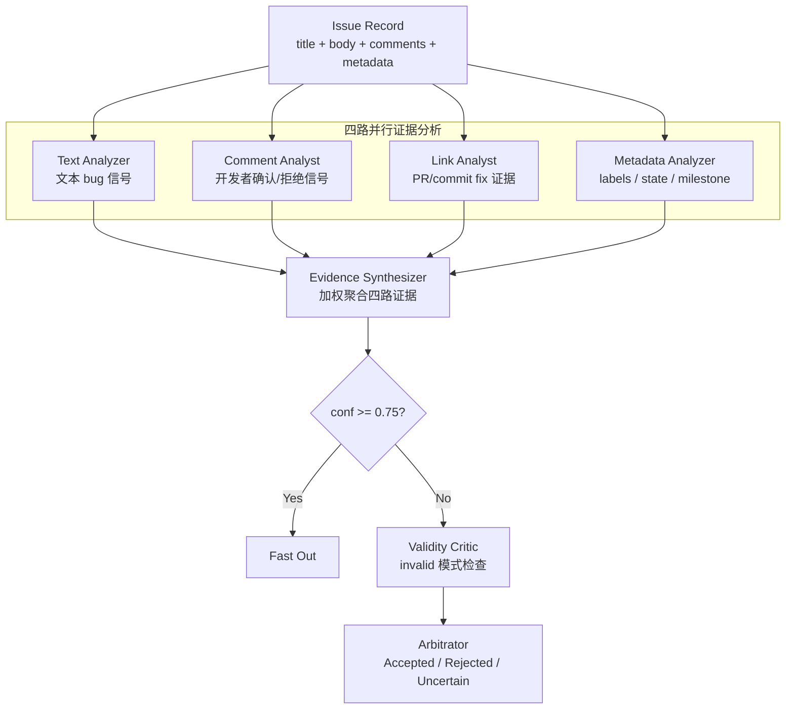
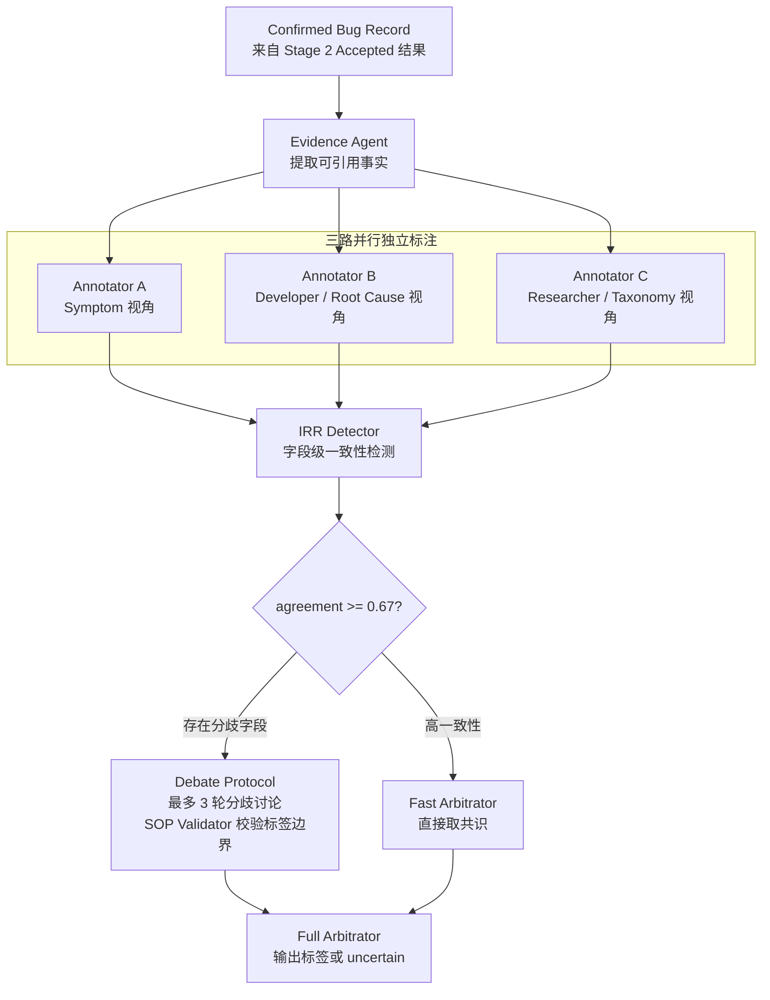

# AutoEmpirical-Reproduce

本仓库用于整理和复现 AutoEmpirical 相关实验数据。目前重点是构建一个面向经验软件工程论文的三阶段 bug 数据集，并保留后续 MAS/LLM 实验所需的统一输入格式。

当前数据集包含 **7 篇论文**，共整理出三个阶段：

| 阶段 | 文件 | 含义 | 数量 |
| --- | --- | --- | ---: |
| Stage 1 Raw | `data/processed/stage1.csv` | 原始收集数据，未人工过滤，未标注 `symptom/root_cause` | 33,822 |
| Stage 2 Filtered | `data/processed/stage2.csv` | 人工过滤后的 bug 相关数据，未标注 `symptom/root_cause` | 4,199 |
| Stage 3 Annotated | `data/processed/stage3.csv` | 最终人工分析/标注数据，包含 `symptom` 和 `root_cause` | 2,050 |

`data/processed/stage1_final.csv` 目前保留为兼容旧脚本的副本，内容等同于 `stage3.csv`。

## 数据集结构

核心元数据文件：

- `data/processed/dataset_metadata.csv`：论文级 metadata，总结每篇论文的项目名、论文信息、三个阶段数量、过滤率和文件路径。
- `data/processed/dataset_metadata.md`：便于人工查看的 Markdown 版 metadata。
- `data/processed/paper_dataset_summary.csv`：论文级汇总表，包含 stage count、label coverage、数据路径和筛选说明。
- `data/processed/paper_dataset_overview.md`：当前数据集概览。

统一大表：

- `data/processed/stage1.csv`
- `data/processed/stage2.csv`
- `data/processed/stage3.csv`

按论文拆分的小文件夹：

```text
data/processed/by_paper/
  <paper_id>/
    stage1.csv
    stage2.csv
    stage3.csv
```

如果要“一篇论文一篇论文地跑实验”，可以直接读取 `data/processed/by_paper/<paper_id>/` 下对应阶段的数据。

## 当前纳入论文

| paper_id | venue | raw_data_time_range | Stage 1 | Stage 2 | Stage 3 |
| --- | --- | --- | ---: | ---: | ---: |
| `ase2022_towards_understanding_the_faults_of` | ASE | 2018-03-27 to 2021-12-23 | 3,859 | 684 | 682 |
| `icse2021_iot_bugs_and_development_challenges` | ICSE | 2012-07-27 to 2020-03-13 | 5,565 | 323 | 320 |
| `issta2024_bugs_in_pods_understanding_bugs` | ISSTA | 2021-06-01 to 2023-05-31 | 8,271 | 429 | 429 |
| `icse2023_an_empirical_study_on_bugs` | ICSE | up to 2022-10-20 | 2,205 | 194 | 194 |
| `icse2024_understanding_transaction_bugs_in_database` | ICSE | 2018-01 to 2022-12 | 7,775 | 140 | 140 |
| `fse2021_an_exploratory_study_of_autopilot` | FSE | not published in source | 569 | 168 | 142 |
| `icse2022_an_empirical_study_on_performance` | ICSME | 2016-08-16 to 2021-03-16 | 5,578 | 2,261 | 143 |

此前发现有两篇论文的 `Stage 1 -> Stage 2` 过滤率为 0，因此已从最终数据集中移除：

- `fse2023_understanding_the_bug_characteristics_and`
- `icse2022_characterizing_and_detecting_bugs_in`

## 字段说明

三个阶段的 CSV 使用统一 schema，主要字段包括：

- `record_id`
- `paper_id`
- `source_project`
- `issue_url`
- `title`
- `body`
- `comments`
- `created_at`
- `updated_at`
- `state`
- `symptom`
- `root_cause`
- `bug_type`
- `component`
- `sub_component`
- `trigger_condition`
- `consequence`
- `fix_type`
- `severity_or_impact`
- `original_label_json`
- `source_file`
- `source_sheet`
- `source_row_index`

其中：

- `stage1.csv` 和 `stage2.csv` 的 `symptom`、`root_cause` 字段为空，因为这两个阶段还没有做最终人工标注。
- `stage3.csv` 的 `symptom`、`root_cause` 字段均已填充。
- 所有阶段都保留 `paper_id`，方便按论文切分实验。

## 重新生成数据

使用下面的脚本可以重新生成最终三阶段数据、metadata 和按论文拆分文件：

```powershell
python scripts/build_final_paper_dataset.py
```

该脚本会生成或更新：

- `data/processed/stage1.csv`
- `data/processed/stage2.csv`
- `data/processed/stage3.csv`
- `data/processed/stage1_final.csv`
- `data/processed/dataset_metadata.csv`
- `data/processed/dataset_metadata.md`
- `data/processed/paper_dataset_summary.csv`
- `data/processed/paper_dataset_overview.md`
- `data/processed/by_paper/<paper_id>/stage1.csv`
- `data/processed/by_paper/<paper_id>/stage2.csv`
- `data/processed/by_paper/<paper_id>/stage3.csv`

脚本中包含对 GitHub 临时下载链接中 `AKIA...` / `ASIA...` 形式字符串的脱敏处理，避免 GitHub push protection 将这些公开临时 URL 误判为 AWS secret。

## 数据质量检查

当前检查结果：

- `stage1.csv`：33,822 行，`symptom/root_cause` 均为空。
- `stage2.csv`：4,199 行，`symptom/root_cause` 均为空。
- `stage3.csv`：2,050 行，`symptom/root_cause` 无缺失。
- 每条记录都有 `paper_id`。
- `dataset_metadata.csv` 的数量由三个 stage 表直接统计得到。

运行测试：

```powershell
python -m pytest tests/test_stage1_converters.py tests/test_stage1_raw.py
```

当前测试结果为 `13 passed`。

## 原始数据与中间数据

主要目录：

- `data/raw/`：从论文 artifact 或公开仓库下载/整理得到的原始文件。
- `data/raw_stage1/`：经过人工检查后用于当前数据集构建的原始数据子集。
- `data/interim/stage1_converted/`：部分论文转换后的中间统一格式。
- `data/processed/`：最终可查看、可实验使用的数据表。

历史/辅助文件：

- `data/processed/stage1_unified_labels.csv`：早期统一 label 表。
- `data/processed/stage1_visuals/`：早期可视化分析结果。
- `data/manifest/`：数据源 manifest、下载状态和人工检查记录。

## MAS v2 设计

当前 MAS 设计以 `docs/mas_design_v2.md` 为准。v2 不再是简单的“Evidence Agent + Filter Agent + Symptom/RootCause Agent + Critic + Arbitrator”串行流程，而是把后续实验拆成两个专项系统：

1. **Stage 2：Bug 有效性验证（MAS-Verify）**，判断 Stage 1 原始候选记录是否应该进入人工过滤后的 bug 集合。
2. **Stage 3：多标签分类（MAS-Classify）**，对 Stage 2 已接受记录标注 `symptom`、`root_cause`、`bug_type`、`fix_type` 等标签。

这个设计的核心目标是模拟人工经验研究中的质量控制流程：先独立收集证据，再进行一致性检测、分歧讨论和最终仲裁，而不是让单个 LLM 一次性给出最终标签。

### 数据阶段与 MAS 任务

当前三阶段数据可以对应到 MAS v2 的两个主要任务：

| 数据阶段 | 人工流程 | MAS 对应任务 |
| --- | --- | --- |
| `stage1.csv` | 原始候选数据 | MAS-Verify 输入 |
| `stage2.csv` | 人工过滤后的 bug 相关数据 | MAS-Verify gold set / MAS-Classify 输入 |
| `stage3.csv` | 人工标注后的最终数据 | MAS-Classify gold labels |

因此，后续实验可以分成两类：

- Stage 2 验证实验：输入 `stage1.csv`，预测哪些记录应该进入 `stage2.csv`。
- Stage 3 标注实验：输入 `stage2.csv`，预测 `stage3.csv` 中的 `symptom`、`root_cause` 等标签。

### Stage 2：MAS-Verify

Stage 2 的核心设计是 **四路并行证据聚合 + 置信度门控**。四类 agent 分别从 issue 文本、评论、链接和结构化元数据中提取证据，再由 Evidence Synthesizer 聚合，低置信度样本进入 Validity Critic 和 Arbitrator。



Stage 2 输出包括 `verdict`、`confidence`、`evidence`、`linked_commits`、`invalid_pattern`、`review_flag`、`text_available` 和 `api_calls`。当前代码中已经有 `stage2_verify_v2` 变体，用于对齐这一部分设计。

### Stage 3：MAS-Classify

Stage 3 的核心设计是 **三路独立标注 + IRR 检测 + 分歧辩论**。它模拟人工实证研究中的 inter-rater reliability 流程：多个标注者先独立判断，再检测字段级一致性；一致性高的字段快速仲裁，有分歧的字段进入 debate protocol。



Stage 3 输出包括 `symptom`、`root_cause`、`bug_type`、`fix_type`、`uncertain_fields`、字段级 `confidence`、`annotator_agreements`、`debate_rounds` 和 `debate_termination`。这部分设计目前记录在 `docs/mas_design_v2.md`，后续代码实现应继续向该设计对齐。

### 实验变体设计

v2 设计中保留的核心消融实验如下：

| Variant | 目的 |
| --- | --- |
| `single_agent` | 单个 LLM 直接完成任务，作为最简单 baseline。 |
| `mas_v1` | 旧版串行 MAS，用于和 v2 直接对比。 |
| `stage2_text_only` | Stage 2 只使用文本分析，验证四路证据聚合的必要性。 |
| `stage2_no_gate` | Stage 2 去掉置信度门控，验证门控对质量和成本的影响。 |
| `stage3_no_irr` | Stage 3 三路并行但不做 IRR 检测，直接多数投票。 |
| `stage3_no_sop` | Stage 3 保留 IRR，但去掉 SOP Validator，验证 taxonomy 约束的作用。 |
| `stage3_no_debate` | Stage 3 检测分歧但不辩论，直接标记 uncertain。 |
| `full_mas_v2` | 完整 v2 系统：Stage 2 MAS-Verify + Stage 3 MAS-Classify。 |

## MAS 实验

仓库中还保留了 AutoEmpirical 的多智能体实验框架：

- `autoempirical_mas/`
- `run_mas_experiment.py`
- `evaluate_mas_results.py`

支持的实验变体包括：

- `single_agent`
- `self_consistency`
- `majority_vote`
- `mas_without_evidence`
- `mas_without_critic`
- `mas_without_arbitrator`
- `mas_without_confidence`
- `full_mas`

离线 smoke test：

```powershell
python run_mas_experiment.py --task filtering --variant full_mas --backend mock --model mock --limit 5
python evaluate_mas_results.py --task filtering --predictions res/mas_filtering_full_mas_mock.jsonl
```

## 环境配置

安装依赖：

```powershell
pip install -r requirements.txt
```

如果需要调用 LLM API，可创建本地 `.env` 文件并填入密钥：

```powershell
Copy-Item .env.example .env
```

`.env` 不应提交到 Git。

## GitHub 提交注意事项

当前三阶段数据文件大小约为：

- `stage1.csv`：约 30 MB
- `stage2.csv`：约 6 MB
- `stage3.csv`：约 8 MB

整体大小可以直接放到 GitHub。提交前建议检查是否存在疑似 secret：

```powershell
git grep -n -E "AKIA[0-9A-Z]{16}|ASIA[0-9A-Z]{16}" HEAD -- data scripts
```

如果重新生成数据，请优先使用：

```powershell
python scripts/build_final_paper_dataset.py
```

不要手动编辑大 CSV，避免 metadata 和阶段表之间数量不一致。
