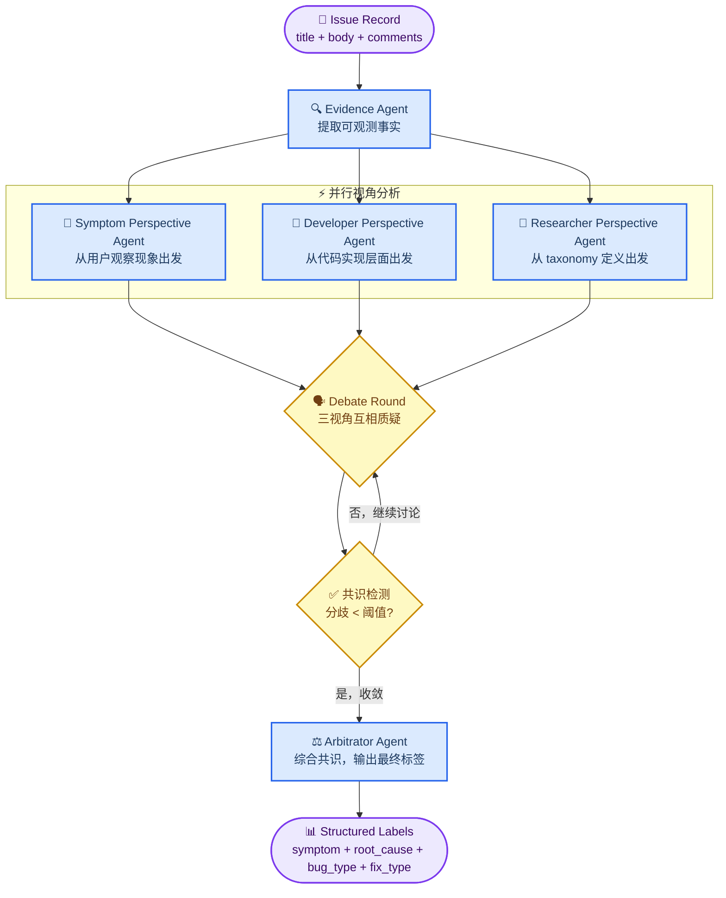
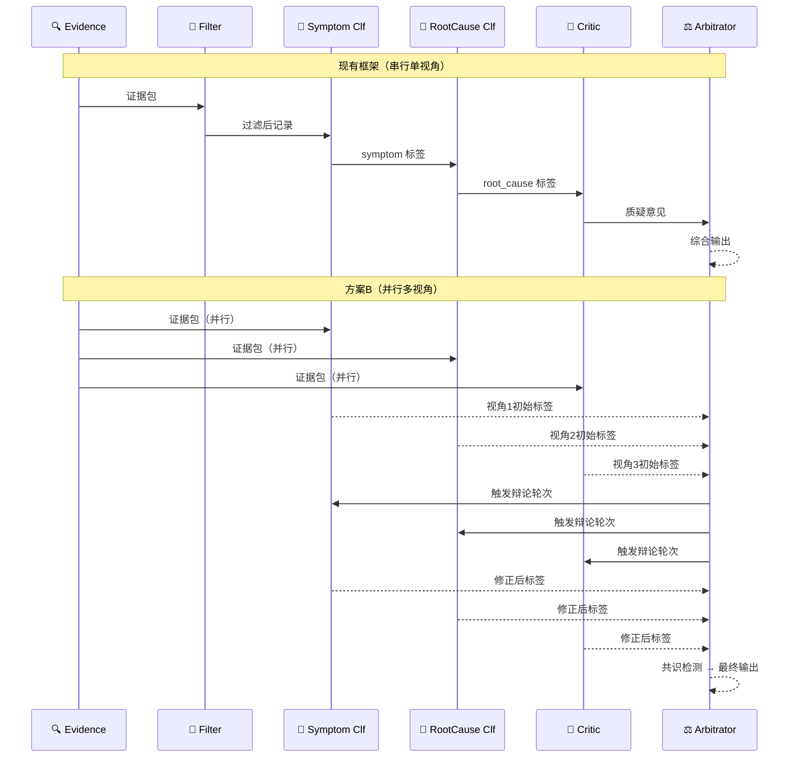

# MAS设计

## 一、背景与动机

### 问题来源

Auto Empirical 的核心任务是：

​	给定一条来自 GitHub issue 的 bug 记录（title + body + comments），**自动输出**符合实证研究分类体系的结构化标签（symptom、root_cause、bug_type、fix_type 等）。

​	在仓库中，现有的 MAS 流水线（Evidence → Filter → Symptom Classifier → Root Cause Classifier → Critic → Arbitrator）已经具备基本的角色分工，但存在一个根本性的局限：**所有分类角色都从同一个视角出发**——即"如何把这条 issue 映射到 taxonomy 标签"。

​	当 issue 描述模糊、标签定义存在重叠、或者 symptom 与 root_cause 之间存在逻辑的不一致时，单视角流水线容易产生歧义。

### 我的思考

​	整理文献时，我注意到一个反复出现的设计模式：**让不同角色从不同的认知立场出发独立分析，再通过结构化讨论收敛到共识**，而不是让所有角色沿着同一条推理链依次传递。

​	这个模式在漏洞检测（开发者视角 vs 测试者视角）、LLM 评估（多评委协商）、根因分析（SOP 约束下的多 Agent 协作）中都被验证有效。我认为这个模式可以直接迁移到 AutoEmpirical 的分类任务上：

- **Symptom 视角**：从"用户观察到了什么现象"出发，关注 observable behavior
- **Developer 视角**：从"代码层面发生了什么"出发，关注 root cause 和 fix type
- **Researcher 视角**：从"这条记录在实证研究分类体系中属于哪一类"出发，关注 taxonomy 一致性

​	三个视角独立分析同一条 issue，再通过 Critic 交叉质疑、Arbitrator 共识综合，最终输出的标签组合在逻辑上更自洽，在 taxonomy 上更准确。

---

## 二、灵感来源与引用文献

### 核心设计灵感

| 论文 | 贡献 | 对本方案的启示 |
|------|------|----------------|
| **Multi-role Consensus through LLMs Discussions for Vulnerability Detection** [^1] | 开发者 + 测试者双视角迭代讨论，F1 +16.13% | 多视角并行分析 + 动态共识终止的基本框架 |
| **CollabEval: Enhancing LLM-as-a-Judge via Multi-Agent Collaboration** [^2] | 三阶段协作评估（初评→讨论→最终判断）+ 战略性共识检测 | Arbitrator 的共识检测机制；合作而非竞争的讨论风格 |
| **Flow-of-Action: SOP Enhanced LLM-Based Multi-Agent System for RCA** [^3] | SOP 约束 LLM 决策空间，RCA 准确率 64% vs ReAct 35.5% | 将 taxonomy 定义编码为 SOP，约束 Classifier 的输出空间 |
| **From Threads to Trajectories** [^4] | 五角色串行流水线从 GitHub issue 提取 root cause + solution plan | 证明多 LLM 角色分工可以从非结构化 issue 中重建结构化标签 |

### 支撑文献

| 论文 | 贡献 |
|------|------|
| **MetaGPT** [^5] | SOP 驱动的多智能体协作，减少级联幻觉 |
| **ChatDev** [^6] | 角色专化通信链，为 AutoEmpirical 的角色设计提供参照 |
| **Agentless** [^7] | 警示：简单结构化工作流有时优于复杂 Agent，需要消融实验验证 MAS 的必要性 |

---

## 三、新的MAS架构设计

### 核心思路

将 bug 分类任务建模为三视角并行分析 + 结构化辩论 + 共识综合的问题，而非单一推理链的顺序传递。

### 整体架构

### 各角色职责定义

#### 🔍 Evidence Agent（保留现有）

从 issue 的 title、body、comments 中提取**可观测事实**，输出结构化证据包：

- 错误信息、堆栈跟踪、异常类型
- 复现步骤、触发条件
- 相关代码片段、PR 链接
- 开发者在评论中的诊断描述

> 设计依据：From Threads to Trajectories 证明了专门的证据提取角色可以显著提升后续分类质量。

#### 👤 Symptom Perspective Agent（新增）

**认知立场**：站在用户/报告者的角度，关注"系统表现出了什么异常行为"。

- 输入：Evidence Agent 的输出 + issue 原文
- 关注维度：observable symptom（crash、hang、wrong output、performance degradation 等）
- 输出：symptom 标签候选 + 支撑证据引用 + 置信度

#### 🔧 Developer Perspective Agent（新增）

**认知立场**：站在代码实现者的角度，关注"代码层面发生了什么导致了这个问题"。

- 输入：Evidence Agent 的输出 + issue 原文
- 关注维度：root_cause（logic error、concurrency issue、resource leak 等）、fix_type
- 输出：root_cause + fix_type 标签候选 + 支撑证据引用 + 置信度

#### 📖 Researcher Perspective Agent（新增）

**认知立场**：站在实证研究者的角度，关注"这条记录在 taxonomy 定义中最准确地属于哪一类"。

- 输入：Evidence Agent 的输出 + taxonomy 定义（SOP 形式，参考 Flow-of-Action）+ 三个视角的初始输出
- 关注维度：taxonomy 一致性、标签定义边界、跨标签逻辑自洽性
- 输出：对其他两个视角的评估意见 + 修正建议 + bug_type 标签候选

> 设计依据：Flow-of-Action 证明将领域知识编码为 SOP 可以防止 LLM 在模糊案例上产生幻觉标签。Researcher Agent 持有 taxonomy SOP，是整个系统的"规则守护者"。

#### 🗣️ Debate Round（新增）

三个视角 Agent 互相审查对方的分类结果，提出质疑和反驳：

- Symptom Agent 质疑 Developer Agent：symptom 描述与 root_cause 是否因果一致？
- Developer Agent 质疑 Researcher Agent：taxonomy 标签是否与代码层面的证据相符？
- Researcher Agent 质疑 Symptom Agent：symptom 标签是否符合 taxonomy 定义的边界？

每轮辩论后进行**共识检测**（参考 CollabEval 的战略性共识检测）：若三个视角的标签分歧低于预设阈值，提前终止；否则进入下一轮。最大轮次上限为 3 轮。

#### ⚖️ Arbitrator Agent（升级自现有框架）

综合辩论结果，输出最终结构化标签：

- 对每个标签字段，选择共识最高的候选
- 对存在持续分歧的字段，标记为 `uncertain` 并记录分歧原因
- 输出置信度分布，供后续质量评估使用

---

## 🔬 与现有框架的对比

| 维度 | 现有框架 | 方案 B |
|------|----------|--------|
| 分析视角 | 单一（分类器视角） | 三视角并行（用户/开发者/研究者） |
| 角色交互 | 串行传递，单向依赖 | 并行分析 + 双向辩论 |
| 错误传播 | 上游错误向下游级联 | 辩论轮次可纠正视角间的不一致 |
| 模糊案例处理 | 依赖单一分类器的置信度 | 多视角分歧显式化，标记 `uncertain` |
| 计算成本 | 较低（串行调用） | 较高（并行 + 辩论轮次） |
| 创新性 | 工程化改进 | 新颖的多视角辩论设计点 |

---

## 四、实验设计

### 消融实验

为了证明方案 B 的每个组件都有贡献，需要以下消融变量：

| 变量 | 描述 | 目的 |
|------|------|------|
| `single_agent` | 单 LLM，一次性输出所有标签 | 基础 baseline |
| `mas_existing` | 现有串行 MAS 框架 | 与方案 B 的直接对比 |
| `mas_parallel_no_debate` | 三视角并行但无辩论轮次 | 验证辩论的必要性 |
| `mas_debate_no_sop` | 有辩论但 Researcher Agent 无 taxonomy SOP | 验证 SOP 约束的必要性 |
| `mas_plan_b_full` | 完整方案 B | 最终系统 |

### 评估指标

- **标签准确率**：与人工标注的 `stage1_unified_labels.csv` 对比，按字段分别计算 F1
- **标签一致性**：symptom 与 root_cause 之间的因果逻辑一致性（人工抽样评估）
- **不确定性校准**：`uncertain` 标记的记录中，人工标注确实存在歧义的比例
- **计算成本**：每条记录的 LLM 调用次数和 token 消耗

### 数据集

使用 `data/processed/stage1_unified_labels.csv` 中的 1,907 条记录，按来源论文分层抽样，确保覆盖不同类型的 bug study。

---

## PS

| 风险 | 说明 | 缓解措施 |
|------|------|----------|
| 计算成本高 | 并行调用 + 辩论轮次使每条记录的 LLM 调用数增加 3-5 倍 | 先在小样本（200 条）上验证效果，再决定是否全量运行 |
| 辩论收敛失败 | 三视角可能在某些模糊案例上无法收敛 | 设置最大轮次上限（3 轮），超限后标记 `uncertain` |
| Agentless 警示 | 复杂 MAS 不一定优于简单结构化工作流 [^7] | 消融实验中包含 `mas_parallel_no_debate` 变体，验证辩论的必要性 |

---

[^1]: Mao, Z., Li, J., Jin, D., Li, M., & Tei, K. (2024). Multi-role Consensus through LLMs Discussions for Vulnerability Detection. arXiv:2403.14274.
[^2]: Qian, Y., Zhang, S., Zhou, Y., Ding, H., Socolinsky, D., & Zhang, Y. (2026). CollabEval: Enhancing LLM-as-a-Judge via Multi-Agent Collaboration. arXiv:2603.00993.
[^3]: Pei, C., Wang, Z., Liu, F., Li, Z., et al. (2025). Flow-of-Action: SOP Enhanced LLM-Based Multi-Agent System for Root Cause Analysis. WWW'25 Industry Track. arXiv:2502.08224.
[^4]: Joynab, N. S., & Hossain, S. B. (2026). From Threads to Trajectories: A Multi-LLM Pipeline for Community Knowledge Extraction from GitHub Issue Discussions. arXiv:2604.25880.
[^5]: Hong, S., et al. (2024). MetaGPT: Meta Programming for A Multi-Agent Collaborative Framework. ICLR 2024. arXiv:2308.00352.
[^6]: Qian, C., et al. (2024). ChatDev: Communicative Agents for Software Development. ACL 2024. arXiv:2307.07924.
[^7]: Xia, C. S., et al. (2024). Agentless: Demystifying LLM-based Software Engineering Agents. arXiv:2407.01489.
