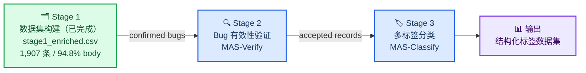
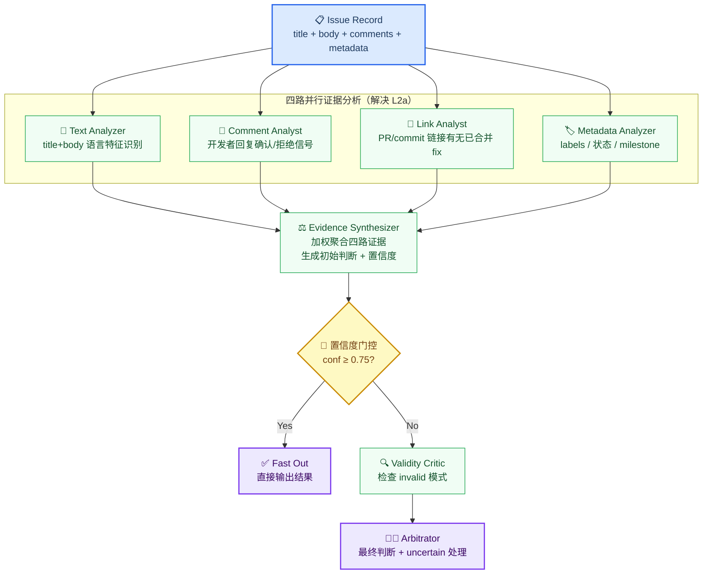
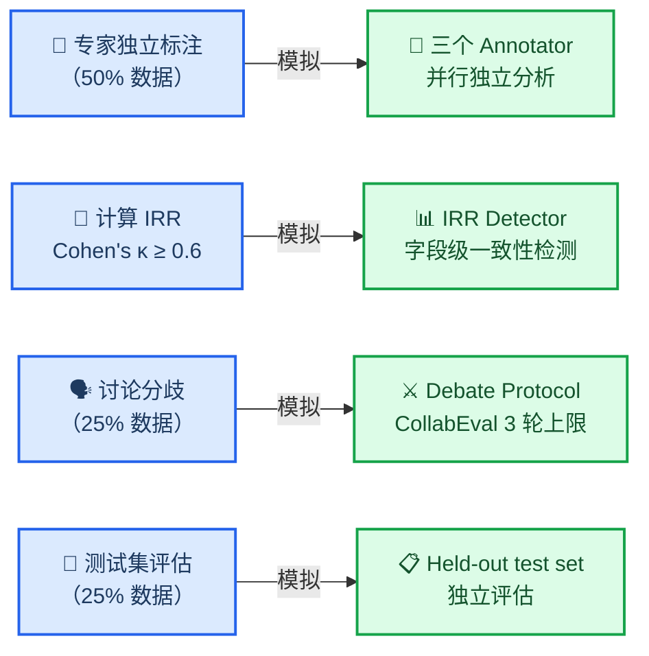
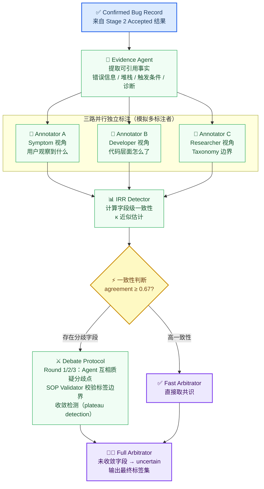

# AutoEmpirical MAS 架构设计报告 v2

> 基于数据集补全后的最新统计（stage1_enriched.csv）、现有方法局限性分析与文献综述，对 Stage 2（Bug Commit 提取）和 Stage 3（多标签分类）的多智能体系统进行专项设计。本文档同时服务于论文写作与代码实现两个层面。

---

## 一、数据集现状分析（基于 stage1_enriched.csv）

### 1.1 整体规模

经 GitHub API 补全后，数据集从 53.9% 的 body 可用率提升至 **94.8%**，显著改善了可用于自动标注的文本质量。

| 指标 | 原始 stage1_unified_labels.csv | 补全后 stage1_enriched.csv |
|------|-------------------------------|--------------------------|
| 总记录数 | 1,907 | 1,907 |
| 有 body | 1,027 (53.9%) | **1,808 (94.8%)** |
| 有 comments | 680 (35.7%) | **1,454 (76.2%)** |
| body + comments 均有 | 675 (35.4%) | **1,437 (75.4%)** |
| 仅有 title | 875 (45.9%) | **99 (5.2%)** |

剩余 99 条无法补全的记录中，60 条来自 fse2023 的 StackOverflow 链接（非 GitHub 来源），39 条为 GitHub 私有仓库或已删除 issue，属于数据来源层面的不可逆缺失。

### 1.2 标签完整性

| 标签字段 | 非空记录数 | 占比 | 说明 |
|---------|-----------|------|------|
| root_cause | 1,907 | **100%** | 所有论文均提供 |
| symptom | 1,869 | 98.0% | 极少量缺失 |
| bug_type | 1,573 | 82.5% | 部分论文未标注 |
| fix_type | 1,154 | 60.5% | 缺失率最高，是分类难点 |
| **全 4 项均有** | **784** | **41.1%** | 可用于完整监督评估的子集 |

**按论文的标签覆盖率差异极大：**

| paper_id | 全 4 项覆盖率 | body 可用率 | 特征 |
|----------|-------------|------------|------|
| icse2022_wechat | **100%** | 100% | 最完整 |
| ase2022 | 92% | 99% | 高质量 |
| ase2021 | 75% | 100% | 标签部分缺失 |
| fse2021 | 0% | 99% | 无 bug_type/fix_type |
| fse2023 | 0% | 76% | 无 bug_type/fix_type |
| icse2022_perf | 0% | 100% | 无 bug_type/fix_type |
| icse2023 | 0% | 100% | 无 bug_type/fix_type |
| icse2024 | 0% | 100% | 无 bug_type/fix_type |

### 1.3 标签分布与 Taxonomy 异构性

高频 symptom 标签（来自不同论文，命名不统一）：

| 标签值 | 出现次数 | 来源论文 |
|--------|---------|---------|
| Crash | 616 | ase2022 |
| Incorrect Functionality | 186 | ase2022 |
| Build & Initialization Failure | 141 | ase2022 |
| performance bug | 137 | ase2022 |
| Poor Performance | 114 | ase2022 |
| Functional error | 62 | icse2024 |

高频 root_cause 标签（同样存在命名异构）：

| 标签值 | 出现次数 | 来源论文 |
|--------|---------|---------|
| Incorrect Code Logic | 159 | ase2022 |
| API Misuse | 73 | ase2022 |
| Dependency Error | 61 | ase2022 |
| Logic error | 50 | icse2022_wechat |
| Inconsistency | 49 | icse2022_wechat |

**关键发现：** `Logic error`（icse2022_wechat）与 `Incorrect Code Logic`（ase2022）语义相同但拼写不同；`performance bug` 与 `Poor Performance` 指向同一概念。这种跨论文的命名异构性是 Stage 3 需要重点解决的问题。

### 1.4 文本质量分析

各论文 body 的平均长度揭示了文本质量的差异：

| paper_id | 平均 body 长度 | 质量评估 |
|----------|--------------|---------|
| icse2022_perf | 2,726 字符 | 丰富，有详细描述 |
| icse2023 | 1,999 字符 | 丰富 |
| ase2021 | 1,622 字符 | 中等 |
| ase2022 | 1,491 字符 | 中等 |
| fse2023 | 1,128 字符 | 中等（含 SO 链接） |
| icse2022_wechat | 64 字符 | 极短（通常仅为 URL） |
| icse2024 | 67 字符 | 极短 |
| fse2021 | 41 字符 | 极短 |

**新发现：** 补全之后，icse2022_wechat、icse2024、fse2021 虽然 body 可用率高，但平均长度极短（41–67 字符），说明这三个论文的 "body" 实际上只是 issue URL 或极简描述，并非真正的 issue 正文。这意味着 Stage 2/3 的处理难度不只是"有没有 body"，还包括 "body 是否有实质内容"。

---

## 二、现有方法的局限性

基于对 17 篇相关文献的系统梳理，现有自动化标注方法存在以下核心缺陷，本设计针对每一条提出对应的解决方案。

### 2.1 通用局限

| ID | 局限描述 | 文献证据 | 严重程度 |
|----|---------|---------|---------|
| L1 | 自动标注假阳性率高达 8–54%，单模型无校验机制 | Dunivin et al., arXiv:2601.09905 | 🔴 高 |
| L2 | LLM 输出非确定性：同 prompt 不同运行产生不同标签，无一致性追踪 | OLAF, arXiv:2512.15979 | 🔴 高 |
| L3 | 标注数据集本身含约 33% 错误标签（feature request 被标为 bug 等）| Laiq & Dobslaw, arXiv:2505.01469 | 🔴 高 |
| L4 | 模糊/不完整 issue 被当作噪声丢弃，而非显式标记处理 | Gon et al., arXiv:2605.17561 | 🟠 中 |
| L5 | 线性流水线的级联错误：上游错误无法被下游纠正 | Dunivin et al., arXiv:2601.09905 | 🟠 中 |
| L6 | LLM 在需要因果推理的 root cause 分析上显著弱于领域专家 | Martinez, arXiv:2510.18456 | 🟠 中 |

### 2.2 Stage 2（Bug 有效性验证）的特有局限

| ID | 局限描述 | 文献证据 |
|----|---------|---------|
| L2a | 过度依赖 issue 文本，忽略 commit/PR 等外部链接证据 | Laiq, arXiv:2505.01469 |
| L2b | 无法区分"被报告的问题"与"真实 bug"，倾向将所有 issue 判为 bug | Andrade et al., arXiv:2503.00660 |
| L2c | invalid/wont-fix 的细粒度子类判断能力极差（F1 低至 0.00–0.29）| Gon et al., arXiv:2605.17561 |
| L2d | 缺乏不确定性量化，永远输出确定性判断 | OLAF, arXiv:2512.15979 |

### 2.3 Stage 3（多标签分类）的特有局限

| ID | 局限描述 | 文献证据 |
|----|---------|---------|
| L3a | 单视角分类导致 symptom 与 root_cause 的因果逻辑不一致 | 本项目现有 pipeline.py |
| L3b | Taxonomy 定义仅作文本提示，LLM 可生成 taxonomy 外的幻觉标签 | Flow-of-Action, arXiv:2502.08224 |
| L3c | 无 Inter-Rater Reliability（IRR）机制，无法模拟人工实证研究的质控流程 | Díaz et al., arXiv:2107.11449 |
| L3d | Critic 做事后检查而非预防性质疑，无法影响分类过程本身 | 现有 pipeline.py |
| L3e | 多 LLM 在温度和 persona 参数下对 consensus 影响极大，但现有系统未建模此变异 | Borchers et al., arXiv:2507.11198 |
| L3f | LLM 的 disagreement 模式本身是有价值的过程数据，被现有系统完全忽略 | Tajik et al., arXiv:2601.12618 |

---

## 三、总体架构与设计原则

### 3.1 三阶段流水线



### 3.2 核心设计原则

本设计遵循以下四条原则，每条原则均有对应的文献依据：

**P1 — 证据驱动（Evidence-Driven）**
所有判断必须锚定于 issue 文本中可引用的具体证据，而非 LLM 的参数化知识。

灵感来源：From Threads to Trajectories（arXiv:2604.25880）的多角色证据提取框架。

**P2 — 多视角独立（Multi-Perspective Independence）**
不同角色从不同认知立场独立分析，防止单视角偏差和级联错误（L5）。

灵感来源：Multi-role Consensus（arXiv:2403.14274）的双视角迭代讨论框架，F1 提升 16.13%。

**P3 — IRR 驱动辩论（IRR-Driven Debate）**
模拟人工实证研究的 IRR 流程——独立标注 → 一致性检测 → 分歧驱动讨论 → 共识综合。

灵感来源：Díaz et al.（arXiv:2107.11449）的 SE 领域 IRR 方法论；AI Annotation Orchestration（arXiv:2511.09785）证明 orchestration 可将 kappa 提升 58%。

**P4 — SOP 约束（SOP-Constrained）**
Taxonomy 定义以标准操作程序（SOP）格式硬约束 LLM 的输出空间，防止幻觉标签（L3b）。

灵感来源：Flow-of-Action（arXiv:2502.08224）在 RCA 任务中将准确率从 35.5% 提升至 64%。

---

## 四、Stage 2 详细设计：Bug 有效性验证 MAS

### 4.1 任务定义

**输入：** `stage1_enriched.csv` 中的一条 issue 记录（title + body + comments + metadata）

**输出：**

```json
{
  "record_id": "ase2022_001",
  "verdict": "Accepted | Rejected | Uncertain",
  "confidence": 0.88,
  "evidence": ["Developer confirmed on 2024-01-10", "PR #456 merged with fix"],
  "linked_commits": ["https://github.com/.../commit/abc123"],
  "invalid_pattern": null,
  "review_flag": false,
  "text_available": "full | short_body | title_only",
  "api_calls": 4
}
```

**解决的问题：** L1（高误报），L2（非确定性），L4（模糊 issue），L2a–L2d。

### 4.2 架构设计

Stage 2 的核心设计思想是**四路并行证据聚合 + 置信度门控**。四路证据相互独立，任何一路都无法单独决定结果，Synthesizer 对证据进行加权聚合。



### 4.3 各 Agent 职责与 Prompt Schema

#### 4.3.1 Text Analyzer

**职责：** 识别 title 和 body 中的 bug 报告语言特征，使用 SOP 步骤约束分析过程（P4 原则）。

**System Prompt（SOP 格式，参考 Flow-of-Action arXiv:2502.08224）：**

```
You are the Text Analyzer Agent. Follow these steps in order:

STEP 1 — Scan for bug-report signals:
  Positive (bug): error messages, stack traces, "crash/fail/error/wrong/unexpected",
  "expected X but got Y", reproducible steps, version/environment info.
  Negative (not-bug): "please add", "feature request", "how do I", documentation issues.

STEP 2 — Account for short body:
  If body length < 100 chars, downgrade confidence by 0.2 regardless of signals.

STEP 3 — Output structured verdict.

Return valid JSON only.
```

**Output Schema：**
```json
{
  "bug_signals": ["'crash with OOM error'", "'stack trace attached'"],
  "non_bug_signals": [],
  "text_verdict": "likely_bug | likely_not_bug | ambiguous",
  "confidence": 0.85,
  "body_quality": "rich | short | url_only | absent"
}
```

**对短 body 的处理（解决 1.4 节发现的新问题）：** icse2022_wechat 等论文的 body 平均仅 64 字符，Text Analyzer 检测到 `body_quality=url_only` 时主动降低置信度，触发 Validity Critic 路径。

#### 4.3.2 Comment Analyzer

**职责：** 从开发者评论中提取"已确认 bug"或"非 bug"的决定性线索，解决 L2a（过度依赖文本，忽略开发者确认信号）。

**Output Schema：**
```json
{
  "confirmation_signals": ["'confirmed by @maintainer'", "'fix merged in PR #456'"],
  "rejection_signals": ["'working as intended'", "'this is not a bug'"],
  "developer_verdict": "confirmed_bug | rejected | ambiguous | no_comments",
  "confidence": 0.92,
  "key_quote": "fix merged in #456 — closes this issue"
}
```

#### 4.3.3 Link Analyzer

**职责：** 解析 issue 文本中的 PR/commit 链接，推断是否存在已合并的 bug fix，解决 L2a。有已合并 fix 是"确实是 bug"的强证据。

**Output Schema：**
```json
{
  "linked_prs": ["https://github.com/.../pull/456"],
  "linked_commits": [],
  "fix_evidence": "merged_fix | open_pr | no_fix | cannot_determine",
  "confidence": 0.95
}
```

#### 4.3.4 Metadata Analyzer

**职责：** 分析 GitHub issue 的结构化元数据，解决 L2b（将 feature request 误判为 bug）。

**Output Schema：**
```json
{
  "github_labels": ["bug", "confirmed"],
  "issue_state": "closed",
  "has_bug_label": true,
  "has_wontfix_label": false,
  "metadata_verdict": "likely_bug | likely_not_bug | ambiguous",
  "confidence": 0.80
}
```

#### 4.3.5 Evidence Synthesizer

**职责：** 加权聚合四路证据，生成初始判断和置信度估计。

**权重设计（基于证据强度，解决 C1 text-only 问题）：**

```python
BASE_WEIGHTS = {
    "link_evidence":      0.40,  # 最强：直接 fix 证明存在 bug
    "developer_comment":  0.30,  # 次强：开发者明确确认
    "metadata":           0.20,  # 中等：GitHub label
    "text_analysis":      0.10,  # 最弱：仅凭文本语言
}

# 当 body 极短（url_only/absent）时，text weight 进一步降低
if body_quality in ("url_only", "absent"):
    weights["text_analysis"] = 0.05
    # 剩余权重重分配给其他三路
```

**Output Schema：**
```json
{
  "synthesized_verdict": "Accepted",
  "confidence": 0.87,
  "evidence_summary": {
    "text": {"verdict": "likely_bug", "weight": 0.10},
    "comments": {"verdict": "confirmed_bug", "weight": 0.30},
    "links": {"verdict": "merged_fix", "weight": 0.40},
    "metadata": {"verdict": "likely_bug", "weight": 0.20}
  },
  "supporting_evidence": ["Developer confirmed", "PR #456 merged"],
  "conflicting_evidence": []
}
```

#### 4.3.6 Validity Critic

**职责：** 专项检查 invalid bug 的四种典型失败模式，解决 L2c（invalid 子类 F1 低至 0.00–0.29，Gon et al. arXiv:2605.17561）。

**SOP 格式 Prompt（四种 invalid 模式枚举）：**

```
You are the Validity Critic. Check ONLY for these four invalid-bug patterns:

PATTERN A — Wrong Version/Environment:
  Signal: issue resolved after updating dependency/runtime version
  → Reject as: invalid_wrong_version

PATTERN B — Usage Error:
  Signal: developer says "this is by design", links to documentation
  → Reject as: invalid_usage_error

PATTERN C — Duplicate:
  Signal: "duplicate of #xxx", or identical issue reference
  → Reject as: invalid_duplicate

PATTERN D — Feature Request Mislabeled:
  Signal: request language present, no observable error behavior
  → Reject as: invalid_feature_request

If none match: maintain current verdict unchanged.
Return JSON only.
```

**Output Schema：**
```json
{
  "invalid_pattern": "none | wrong_version | usage_error | duplicate | feature_request",
  "revised_verdict": "Accepted | Rejected | Uncertain",
  "revised_confidence": 0.90,
  "evidence_for_revision": ["developer explicitly said 'working as designed'"]
}
```

#### 4.3.7 Arbitrator

**职责：** 综合 Synthesizer 和 Critic 的结果，输出最终判断。当置信度 < 0.45 或证据严重冲突时输出 `Uncertain`，解决 L2d（缺乏不确定性量化）。

**Uncertain 触发条件：**

```python
def should_mark_uncertain(confidence: float, evidence_summary: dict) -> bool:
    if confidence < 0.45:
        return True
    # 有强正反证据同时存在（如 link=merged_fix 但 comments=rejected）
    strong_positive = evidence_summary["links"]["verdict"] == "merged_fix"
    strong_negative = evidence_summary["comments"]["verdict"] == "rejected"
    if strong_positive and strong_negative:
        return True
    return False
```

### 4.4 置信度门控参数

**阈值 ≥ 0.75 的依据：**

Dunivin et al.（arXiv:2601.09905）报告自动标注假阳性率 8–54%，说明直接信任高置信度输出本身有风险。0.75 作为初始阈值，在 50 条开发集上通过 precision-recall 曲线确定最终值。高于此阈值的案例走 Fast Path（4 次 API 调用），低于此阈值的案例进入 Validity Critic 路径（6 次 API 调用）。

---

## 五、Stage 3 详细设计：多标签分类 MAS

### 5.1 任务定义

**输入：** Stage 2 输出的 `Accepted` 记录

**输出：**

```json
{
  "record_id": "ase2022_001",
  "labels": {
    "symptom": "Crash",
    "root_cause": "Resource Management",
    "bug_type": "Memory Bug",
    "fix_type": "Code Change"
  },
  "uncertain_fields": [],
  "consistency_score": 0.92,
  "annotator_agreements": {
    "symptom": 1.0, "root_cause": 0.67, "bug_type": 1.0, "fix_type": 1.0
  },
  "debate_rounds": 1,
  "debate_termination": "convergence",
  "confidence": {"symptom": 0.95, "root_cause": 0.82, "bug_type": 0.88, "fix_type": 0.91}
}
```

**解决的问题：** L3a–L3f，以及数据集中的 taxonomy 异构性（见 1.3 节）。

### 5.2 人工 IRR 流程的 MAS 模拟

图如下：



AI Annotation Orchestration（arXiv:2511.09785）的实证结果表明：引入 orchestration（让 verifier 检查 annotator 的标签）可将 Cohen's kappa 提升 58%，为本设计的 IRR-debate 机制提供了直接的实验支持。

### 5.3 架构设计



### 5.4 三个 Annotator 的 Prompt 设计

#### Annotator A：Symptom 视角

**认知立场：** "站在用户角度——系统表现出了什么可观测的异常行为？"

```
You are Annotator A: Symptom Perspective.
Focus ONLY on what the user observed. Do not reason about why it happened.

Symptom taxonomy (SOP):
A. Crash — program terminates unexpectedly / fatal exception / OOM
B. Incorrect Functionality — wrong output, wrong behavior, off-by-one
C. Build & Initialization Failure — fails to build, install, or import
D. Performance Degradation — slowdown, excessive memory, timeout
E. Hang — stops responding, infinite loop
F. Data Corruption — data modified incorrectly
G. Security Vulnerability — unintended security-relevant behavior

STEP 1: Identify observable symptoms from evidence package.
STEP 2: Map to exactly ONE primary category.
STEP 3: Cite the specific evidence phrase that supports your choice.

Return JSON only. Do not reveal reasoning beyond the JSON.
```

**Output Schema：**
```json
{
  "annotator": "A",
  "symptom": "Crash",
  "symptom_evidence": "ResourceExhaustedError: OOM when allocating tensor",
  "confidence": 0.93,
  "uncertain": false
}
```

#### Annotator B：Developer 视角

**认知立场：** "站在实现者角度——代码层面发生了什么导致了这个问题？"

```
You are Annotator B: Developer Perspective.
Focus on the TECHNICAL ROOT CAUSE and how to fix it. Do not describe symptoms.

Root cause taxonomy (SOP):
A. Incorrect Code Logic — wrong algorithm, condition, or calculation
B. API Misuse — incorrect use of library/framework API
C. Dependency Error — wrong version, breaking change in upstream
D. Resource Management — memory leak, buffer overflow, file handle leak
E. Concurrency Issue — race condition, deadlock, data race
F. Configuration Error — wrong parameter, wrong environment setup
G. Type/Value Error — null pointer, index out of bounds, type mismatch

Fix type taxonomy:
A. Code Change — logic fix in source
B. Configuration Fix — parameter or config change
C. Version Update — upgrading dependency
D. Documentation Fix — clarifying usage
E. Workaround — temporary mitigation

STEP 1: Identify root cause from developer diagnosis in evidence.
STEP 2: Infer fix type from available hints.
STEP 3: Cite evidence.

Return JSON only.
```

**Output Schema：**
```json
{
  "annotator": "B",
  "root_cause": "Resource Management",
  "root_cause_evidence": "Memory pre-allocation issue in cuDNN backend",
  "fix_type": "Code Change",
  "fix_evidence": "PR #456 modifies memory allocation logic",
  "confidence": 0.82,
  "uncertain": false
}
```

#### Annotator C：Researcher 视角

**认知立场：** "站在实证研究者角度——这条记录在分类体系中属于哪一类？Annotator A/B 的标签是否彼此因果自洽？"

**Annotator C 同时承担一致性仲裁的职责，直接应对 L3a（symptom-root_cause 不一致）和 L3b（taxonomy 外幻觉标签）：**

```
You are Annotator C: Researcher Perspective.
Your dual role:
  1. Determine bug_type from the research taxonomy
  2. Check whether Annotator A and B's labels are causally consistent

Bug type taxonomy (SOP):
A. Semantic Bug — wrong semantics / incorrect behavior
B. Performance Bug — functionally correct but inefficient
C. Memory Bug — memory allocation or access error
D. Concurrency Bug — race condition or deadlock
E. Configuration Bug — wrong configuration causes failure
F. Security Bug — enables unintended access

Consistency check rules:
- Crash + Resource Management → CONSISTENT (common pattern)
- Incorrect Functionality + Incorrect Code Logic → CONSISTENT
- Crash + API Misuse → CONSISTENT (misuse can cause crashes)
- Performance Degradation + Incorrect Code Logic → NEEDS VERIFICATION
  (logic errors don't typically cause perf issues; check evidence)
- Incorrect Functionality + Resource Management → INCONSISTENT
  (resource issues cause crashes, not wrong output — flag for debate)

Return JSON only.
```

**Output Schema：**
```json
{
  "annotator": "C",
  "bug_type": "Memory Bug",
  "bug_type_evidence": "OOM error from memory pre-allocation classified as Memory Bug in SE literature",
  "consistency_check": {
    "symptom_root_cause_consistent": true,
    "explanation": "Crash (A) caused by Resource Management (B) is a well-documented pattern",
    "flag_for_debate": false
  },
  "confidence": 0.87,
  "uncertain": false
}
```

### 5.5 IRR 检测协议

**理论依据：** Díaz et al.（arXiv:2107.11449）在 SE 领域 IRR 研究中指出 Cohen's κ ≥ 0.6 为可接受阈值。本设计使用三个 Annotator 的字段级多数一致性作为 κ 的近似估计，计算成本低且在三分类场景下等价。

**计算公式：**

```python
from collections import Counter

def field_agreement(annotations: list[dict], field: str) -> float:
    """三个 Annotator 对某字段的一致性：多数标签出现次数 / 总数"""
    values = [a[field] for a in annotations if not a.get("uncertain")]
    if len(values) < 2:
        return 0.0
    most_common_count = Counter(values).most_common(1)[0][1]
    return most_common_count / len(values)

DEBATE_THRESHOLD = 0.67  # 等价于"至少有1个与另2个不同"

fields_to_debate = [
    f for f in ["symptom", "root_cause", "bug_type", "fix_type"]
    if field_agreement(annotations, f) < DEBATE_THRESHOLD
]
```

**IRR Detector 输出示例：**
```json
{
  "field_agreements": {
    "symptom": 1.0,
    "root_cause": 0.67,
    "bug_type": 0.33,
    "fix_type": 1.0
  },
  "fields_to_debate": ["bug_type"],
  "fast_path_fields": ["symptom", "root_cause", "fix_type"],
  "trigger_debate": true
}
```

### 5.6 辩论协议（Debate Protocol）

**设计依据：** CollabEval（arXiv:2603.00993）的三阶段协作评估框架，以及 Disagreement as Data（arXiv:2601.12618）的发现——LLM 的 disagreement 模式本身是有分析价值的过程数据（L3f），不应仅被视为需要消除的噪声。

#### 辩论轮次结构

每轮辩论对每个 `fields_to_debate` 中的字段执行以下步骤：

1. **Annotator A** 陈述自己的立场 + 提出对 B/C 不同意见的质疑
2. **Annotator B** 回应，可维持或修改立场
3. **Annotator C** 作为 Researcher，引用 SOP 定义裁定双方立场的 taxonomy 合规性
4. **SOP Validator** 静默检查：任何 Agent 提出的标签是否在 SOP 定义范围内

#### SOP Validator 的校验逻辑

```python
def validate_label(label: str, field: str, sop: dict) -> dict:
    valid_labels = {cat["name"] for cat in sop[field]["categories"]}
    aliases = sop.get("aliases", {}).get(field, {})

    # 尝试别名归一化（解决 1.3 节 taxonomy 异构性问题）
    normalized = aliases.get(label.lower(), label)

    if normalized not in valid_labels:
        return {
            "valid": False,
            "reason": f"'{label}' not in taxonomy",
            "suggested": find_closest(label, valid_labels)
        }
    return {"valid": True, "normalized_label": normalized}
```

**Taxonomy 别名映射（解决数据集异构性，见 1.3 节）：**

```json
{
  "aliases": {
    "symptom": {
      "performance bug": "Performance Degradation",
      "poor performance": "Performance Degradation",
      "functional error": "Incorrect Functionality",
      "hang": "Hang",
      "incorrect": "Incorrect Functionality",
      "crash": "Crash"
    },
    "root_cause": {
      "logic error": "Incorrect Code Logic",
      "inconsistency": "Incorrect Code Logic",
      "incompatibility between 3rd-party dl library and tf.js": "Dependency Error"
    }
  }
}
```

#### 收敛检测与终止条件

**三条终止规则（来自 CollabEval arXiv:2603.00993）：**

```python
def check_termination(
    prev_agreements: dict,
    curr_agreements: dict,
    round_num: int,
    max_rounds: int = 3
) -> tuple[bool, str]:

    # 规则 1：达到最大轮次
    if round_num >= max_rounds:
        return True, "max_rounds"

    # 规则 2：所有分歧字段收敛
    if all(v >= 0.67 for v in curr_agreements.values()):
        return True, "convergence"

    # 规则 3：Plateau 检测——本轮无提升
    total_improvement = sum(
        curr_agreements[f] - prev_agreements[f]
        for f in curr_agreements
    )
    if total_improvement <= 0.0:
        return True, "plateau"

    return False, "continue"
```

- **convergence**：正常收敛，Full Arbitrator 输出共识标签
- **max_rounds** / **plateau**：辩论失败，对应字段标记为 `uncertain`，记录 disagreement 模式供分析（L3f）

### 5.7 Full Arbitrator 与 uncertain 输出

当辩论终止后，Full Arbitrator 对每个字段：
- 若 agreement ≥ 0.67：输出多数标签，记录置信度
- 若 agreement < 0.67（辩论失败）：`label=null, uncertain=true`

**处理 fix_type 缺失问题（见 1.2 节，60.5% 有标签）：**

fix_type 在数据集中缺失率高达 39.5%，这既是数据问题也是任务难度问题。Full Arbitrator 对 fix_type 使用更低的 uncertain 阈值（0.5 而非 0.67），并在输出中单独标记 `fix_type_inferred=true` 以示区分。

---

## 六、与现有代码的映射

### 6.1 `pipeline.py` 改动摘要

| 现有方法 | 新方法 | 变化说明 |
|---------|--------|---------|
| `_run_filtering`：3 Filter Agent 多数投票 | `_run_stage2_verify_v2`：四路并行 + 置信度门控 | 新增四类专项 Analyzer |
| `_run_classification`：Symptom→RootCause 串行 | `_run_stage3_classify_v2`：三 Annotator 并行 + IRR | 并行取代串行 |
| 单一 Critic（事后检查）| Validity Critic（Stage 2）+ SOP Validator（Stage 3）| 职责拆分 |
| 单一 Arbitrator | Fast + Full 双轨 Arbitrator | 无分歧时跳过辩论 |
| 无不确定性字段 | `uncertain_fields`、`review_flag` | 新增 |

### 6.2 新增文件

```
autoempirical_mas/
├── pipeline.py            # 新增 _run_stage2_verify_v2, _run_stage3_classify_v2
├── prompts.py             # 新增 Stage 2/3 专项 prompt（SOP 格式）
├── agents.py              # 新增 IRRDetector, DebateOrchestrator, SOPValidator
├── schemas.py             # 新增 Stage2Result, Stage3Result, AnnotatorOutput
└── sop/
    ├── symptom_sop.yaml
    ├── root_cause_sop.yaml
    ├── bug_type_sop.yaml
    └── taxonomy_aliases.json
```

---

## 七、消融实验设计

### 7.1 实验变体

| 变体 | 描述 | 验证目标 |
|------|------|---------|
| `single_agent` | 单 LLM 一次性输出全部标签 | 基础 baseline |
| `mas_v1` | 现有串行 MAS（Symptom→RootCause→Critic→Arbitrator）| 与新设计直接对比 |
| `stage2_text_only` | Stage 2 仅用 Text Analyzer | 验证四路证据必要性（L2a）|
| `stage2_no_gate` | Stage 2 无置信度门控 | 验证门控对效率/质量影响 |
| `stage3_no_irr` | Stage 3 三视角并行但无 IRR，直接多数投票 | 验证 IRR-Debate 必要性（L3c）|
| `stage3_no_sop` | Stage 3 有 IRR 但无 SOP Validator | 验证 SOP 约束必要性（L3b）|
| `stage3_no_debate` | Stage 3 有 IRR 检测但无辩论，直接 uncertain | 验证辩论的贡献 |
| `full_mas_v2` | 完整新设计 Stage 2 + Stage 3 | 最终系统 |

### 7.2 评估指标

**Stage 2：**

| 指标 | 说明 |
|------|------|
| Precision / Recall / F1（Accepted）| 核心分类质量 |
| False Positive Rate | 非 bug 被接受比例，对应 L1 |
| Uncertain Calibration | `uncertain` 标记中人工确认难以判断的比例 |
| API calls / record | 计算成本 |

**Stage 3：**

| 指标 | 说明 |
|------|------|
| Per-field F1（symptom / root_cause / bug_type / fix_type）| 各字段分类质量 |
| Symptom-RootCause Consistency Rate | 人工抽样 100 条，因果逻辑自洽比例，对应 L3a |
| Taxonomy Violation Rate | SOP Validator 拒绝次数/总标签数，对应 L3b |
| IRR Trigger Rate | 进入辩论的记录比例 |
| Debate Termination Distribution | convergence / plateau / max_rounds 各占比 |
| Uncertain Field Precision | `uncertain` 字段中人工标注确实困难的比例 |
| Kappa（agent vs. gold）| 参考 OLAF（arXiv:2512.15979）的 calibration 要求 |

### 7.3 数据划分

**类比人工实证研究的 IRR 流程：**

| 子集 | 规模 | 用途 |
|------|------|------|
| 开发集（50%）| ~950 条 | Prompt 调优、消融实验、超参数选择 |
| 讨论集（25%）| ~475 条 | 完整流水线运行，人工审查 uncertain 案例 |
| 测试集（25%）| ~475 条 | 最终评估，不参与任何调优 |

**分层采样策略：**

```python
# 按 paper_id 和 text_availability 分层，确保各 paper 在三子集中均有代表
# text_availability 分三层：
#   "rich"     ：body 长度 > 500 字符（ase2021/ase2022/icse2022_perf/icse2023 类）
#   "short"    ：body 长度 ≤ 500 字符（fse2023/icse2022_wechat/icse2024/fse2021 类）
#   "absent"   ：99 条无 body 记录
stratify_columns = ["paper_id", "text_availability"]
```

---

## 八、参考文献

| 引用 | 论文 | 使用点 |
|------|------|--------|
| [Dunivin 2026] | Self-reflection in Automated Qualitative Coding. arXiv:2601.09905 | L1：假阳性率 8–54%；置信度门控依据 |
| [Laiq 2025] | Automatic Techniques for Issue Report Classification. arXiv:2505.01469 | L3：训练数据噪声；L2a：忽略外部证据 |
| [Andrade 2025] | Empirical Study on Bug Report Classification. arXiv:2503.00660 | L2b：feature request 误判为 bug |
| [Gon 2026] | Automated Root-Cause Subclassification for Invalid Bug Reports. arXiv:2605.17561 | L2c：invalid 子类 F1 低至 0.00–0.29 |
| [OLAF 2026] | OLAF: Towards Robust LLM-Based Annotation. arXiv:2512.15979 | L2：非确定性；L2d：不确定性量化；kappa 评估 |
| [Baltes 2025] | Guidelines for Empirical Studies involving LLMs. arXiv:2508.15503 | L2：提示敏感性 |
| [Martinez 2025] | LLMs in Thematic Analysis. arXiv:2510.18456 | L6：领域推理不足 |
| [Chen 2025] | LLM Capability in Decomposing Bug Reports. arXiv:2504.20911 | L6；SWE-MIMIC-Bench 证据提取 schema |
| [Díaz 2021] | Inter-rater Reliability in Grounded Theory Studies. arXiv:2107.11449 | IRR 设计依据；κ ≥ 0.6 阈值 |
| [Orchestration 2024] | AI Annotation Orchestration: LLM Verifiers. arXiv:2511.09785 | **orchestration 提升 kappa 58%**；IRR-debate 直接实验支持 |
| [Tajik 2026] | Disagreement as Data: Reasoning Trace Analytics. arXiv:2601.12618 | L3f：disagreement 作为有价值过程数据 |
| [Borchers 2025] | Temperature and Persona Shape LLM Consensus. arXiv:2507.11198 | L3e：温度和 persona 对 consensus 的影响 |
| [Flow-of-Action 2025] | Flow-of-Action: SOP Enhanced LLM MAS for RCA. arXiv:2502.08224 | P4 SOP 约束；SOP 文档格式；RCA 准确率 64% vs 35.5% |
| [CollabEval 2026] | CollabEval: Enhancing LLM-as-a-Judge. arXiv:2603.00993 | Debate Protocol；3 轮上限；plateau detection |
| [Multi-role 2024] | Multi-role Consensus through LLMs for Vuln. Detection. arXiv:2403.14274 | 三视角并行框架；F1 +16.13% |
| [Threads 2026] | From Threads to Trajectories. arXiv:2604.25880 | P1 证据驱动；Evidence Agent 设计 |
| [MetaGPT 2024] | MetaGPT. arXiv:2308.00352 | Publish-subscribe 消息池；SOP 驱动 MAS |
