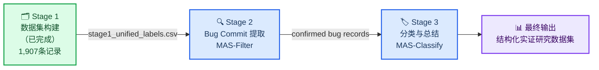
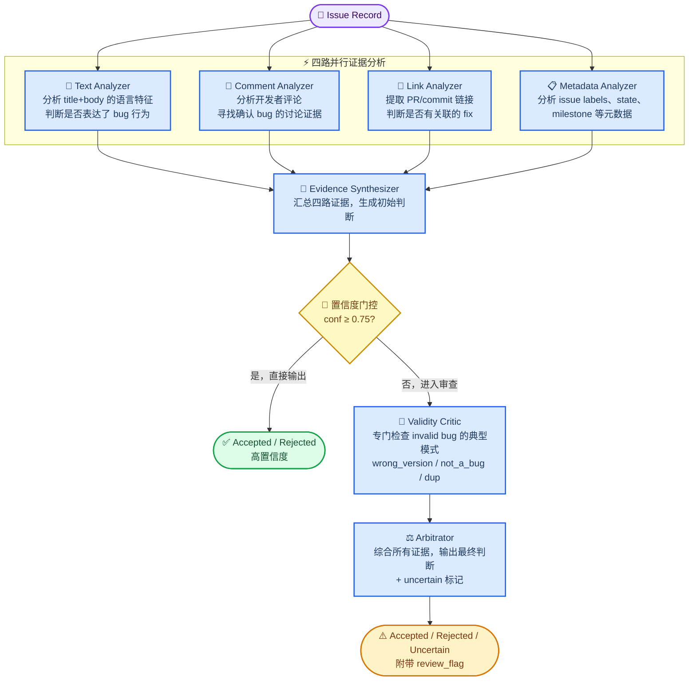
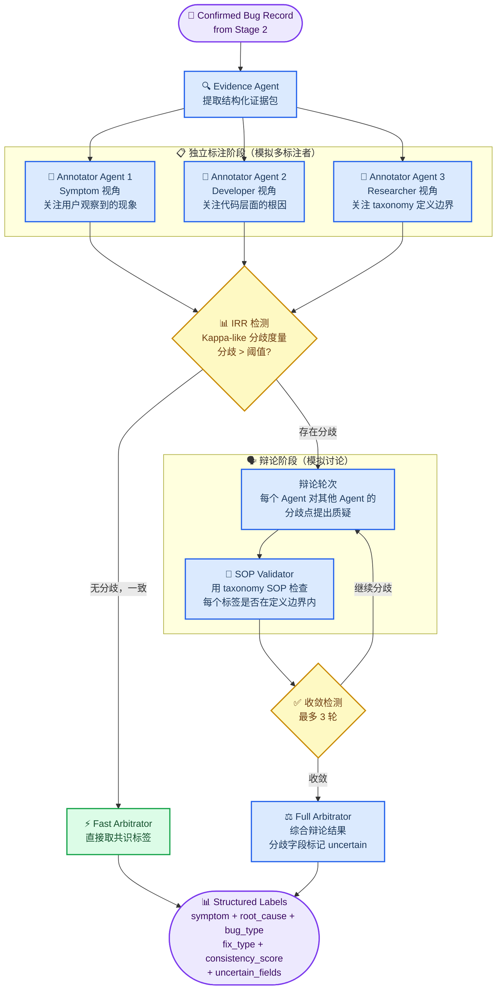

# AutoEmpirical 细化 MAS 架构设计报告

> 基于现有方法局限性分析，针对 Stage 2（Bug Commit 提取）和 Stage 3（分类与总结）分别设计多智能体系统

---

## 一、背景：师兄的核心反馈

根据与师兄的讨论，本次设计需要解决以下几点：

1. **三阶段要分离**：问题定义 → Stage 2（bug commit 提取）→ Stage 3（分类与总结），每个阶段的任务不同，需要专门设计不同的多智能体架构
2. **从缺点出发设计**：先找到现有方法的具体问题（按点列出），再针对性设计 MAS 来解决这些问题
3. **类比人工 Empirical Study 的流程**：人工做实证研究时，多个专家各自独立标注 50%，讨论后再一起标注 25%，最后 25% 做测试——这个流程应该在 MAS 中被模拟
4. **设计要细化，不能只停留在表面**：每个阶段的 Agent 设计要有具体的角色职责和交互协议

---

## 二、现有方法的局限性分析

### 2.1 自动化实证 SE 研究的通用问题

根据对 15 篇相关文献的系统梳理，现有自动化方法存在以下六类核心缺陷：

| # | 问题 | 严重程度 | 代表文献 |
|---|------|----------|----------|
| **L1** | **高误报率**：自动标注的假阳性率高达 8%–54%，即使 benchmark F1 看起来不错 | 🔴 高 | arXiv:2601.09905 |
| **L2** | **训练数据噪声**：现有 bug 数据集中约 33% 的标签本身是错的（feature request 被标为 bug 等） | 🔴 高 | arXiv:2505.01469, 2503.00660 |
| **L3** | **提示敏感性与非确定性**：同一条 issue，同一个 prompt，不同运行产生不同标签；一致性从未被系统追踪 | 🔴 高 | arXiv:2508.15503, 2512.15979 |
| **L4** | **模糊/不完整 issue 无处理机制**：几乎所有现有系统把模糊报告当作噪声丢弃，而不是显式标记并特殊处理 | 🟠 中 | arXiv:2505.01469, 2605.17561 |
| **L5** | **级联错误**：线性流水线中上游角色的错误会向下游传播，Arbitrator 无法纠正已丢失的信息 | 🟠 中 | arXiv:2601.09905（critic 只能部分修正） |
| **L6** | **潜在语义推理不足**：LLM 在 surface-level 标注上表现尚可，但对需要领域知识的深层因果推理（root cause 分析）仍然显著弱于人类专家 | 🟠 中 | arXiv:2510.18456, 2504.20911 |

### 2.2 Stage 2（Bug Commit 提取）的特有问题

Stage 2 对应"给定一个 issue，判断它是否是真正的 bug，并提取相关的 commit/PR 证据"。现有方法的局限：

- **L2-1 过度依赖 issue 文本，忽略 commit 证据**：绝大多数分类工作只用 issue 的 title+body，没有利用关联 PR、linked commits、fix diffs 等结构化证据 [^2505.01469]
- **L2-2 无法区分"被报告的问题"和"真正的 bug"**：用户报告的 issue 不一定是 bug（可能是使用问题、feature request、文档问题），但模型倾向于把所有 issue 都分类为 bug [^2503.00660]
- **L2-3 对 invalid/wont-fix 的处理能力差**：Root-cause subclassification 在 "Wrong Version" 等子类上 F1 低至 0.00–0.29，说明细粒度的有效性判断远未解决 [^2605.17561]
- **L2-4 没有不确定性输出**：系统总是输出一个确定的标签，而不说"我不确定，需要人工审核"

### 2.3 Stage 3（分类与总结）的特有问题

Stage 3 对应"对已确认是 bug 的记录，提取 symptom、root_cause、bug_type、fix_type 等多维度标签"。现有方法的局限：

- **L3-1 单视角分类导致标签内部不一致**：symptom 和 root_cause 由不同角色独立生成，但没有机制验证它们之间的因果逻辑一致性（如 symptom=crash 但 root_cause=wrong_output，这在逻辑上是矛盾的）[^pipeline.py]
- **L3-2 Taxonomy 定义没有被强制执行**：现有 prompt 把 taxonomy 作为文本提示，而不是约束；LLM 可以自由生成不在 taxonomy 范围内的标签 [^2502.08224]
- **L3-3 无 Inter-Rater Reliability 机制**：人工实证研究要求多个标注者各自独立标注，然后计算 IRR（Cohen's Kappa 等）再讨论分歧，但现有 MAS 系统没有模拟这个过程 [^2107.11449]
- **L3-4 Critic 只做事后检查，不做预防性质疑**：当前 Critic Agent 在所有分类器输出之后才进行质疑，无法影响分类过程本身；人工标注中，标注者之间的实时讨论会防止系统性偏差 [^2601.09905]
- **L3-5 数据量划分没有被建模**：人工研究中通常 50% 独立标注 + 25% 讨论后标注 + 25% 测试集，MAS 从来不模拟这个分批处理逻辑

---

## 三、总体三阶段架构



---

## 四、Stage 2 细化设计：Bug Commit 提取 MAS

### 4.1 任务定义

**输入**：一条 issue 记录（title + body + comments + metadata）
**输出**：
- `label`：Accepted（确认为 bug）/ Rejected / Uncertain
- `evidence`：支撑判断的具体证据列表
- `linked_commits`：关联的 bug-fix commit/PR（若存在）
- `confidence`：置信度
- `review_flag`：是否需要人工审核

**解决的核心问题**：L2-1, L2-2, L2-3, L2-4

### 4.2 架构设计



### 4.3 各 Agent 职责

| Agent | 职责 | 针对的问题 |
|-------|------|-----------|
| **Text Analyzer** | 用语言模式识别 bug 报告特征（错误信息、"expected X got Y"、"crash when"等） | L2-2 |
| **Comment Analyzer** | 从开发者回复中提取"confirmed bug"、"will fix"、"not a bug"等决定性线索 | L2-1, L2-2 |
| **Link Analyzer** | 解析 issue 中的 PR/commit 链接，判断是否存在已合并的 fix | L2-1, L2-3 |
| **Metadata Analyzer** | 分析 label、state（closed/open）、milestone、assignee 等结构化字段 | L2-2 |
| **Evidence Synthesizer** | 汇总四路证据，生成初始判断和置信度估计 | L2-4 |
| **Validity Critic** | 专门检查 invalid bug 的已知失败模式（参考 arXiv:2605.17561 的子类体系） | L2-3, L2-4 |
| **Arbitrator** | 最终决策；低置信度时输出 `Uncertain` + `review_flag=True` | L2-4 |

### 4.4 置信度门控的设计依据

> 参考文献：arXiv:2601.09905 发现第一级 LLM 的假阳性率高达 8%–54%。引入置信度门控（Synthesizer 置信度 ≥ 0.75 时直接输出，否则触发 Critic）可以将高置信度案例快速处理，将低置信度案例送入更重的审查流程，而不是对所有案例都用同样的计算量。

---

## 五、Stage 3 细化设计：分类与总结 MAS

### 5.1 任务定义

**输入**：Stage 2 确认的 bug 记录
**输出**：
- `symptom`：observable bug symptom（层级标签）
- `root_cause`：underlying technical cause（层级标签）
- `bug_type`：bug 类型
- `fix_type`：修复方式
- `consistency_score`：symptom 与 root_cause 的逻辑一致性得分
- `uncertain_fields`：不确定的标签字段列表

**解决的核心问题**：L3-1, L3-2, L3-3, L3-4, L3-5

### 5.2 架构设计：模拟人工 IRR 流程

师兄提到人工实证研究的标准流程：**各自独立标注 → 讨论分歧 → 再一起标注 → 测试集验证**。Stage 3 的 MAS 设计直接模拟这个流程。



### 5.3 各 Agent 职责

| Agent | 职责 | 针对的问题 |
|-------|------|-----------|
| **Evidence Agent** | 从 issue 中提取可观测事实（错误信息、堆栈、触发条件、代码片段）| L3-4 |
| **Annotator Agent 1（Symptom 视角）** | 从用户/报告者角度标注 symptom：系统表现出了什么异常行为？ | L3-1, L3-3 |
| **Annotator Agent 2（Developer 视角）** | 从实现者角度标注 root_cause + fix_type：代码层面发生了什么？ | L3-1, L3-3 |
| **Annotator Agent 3（Researcher 视角）** | 从 taxonomy 定义出发标注 bug_type：这条记录最准确地属于哪一类？ | L3-2, L3-3 |
| **IRR Detector** | 计算三个标注者之间的标签一致性（类 Kappa 度量）；分歧超过阈值时触发辩论 | L3-3 |
| **Debate Round** | 每个 Agent 对其他 Agent 的分歧点提出证据支撑的质疑 | L3-4, L3-5 |
| **SOP Validator** | 用 taxonomy 的 SOP 定义检查辩论中提出的标签是否在边界内（参考 Flow-of-Action） | L3-2 |
| **Fast Arbitrator** | 无分歧时直接取共识，节省计算成本（参考 CollabEval 战略性共识检测） | — |
| **Full Arbitrator** | 有分歧时综合辩论结果；持续分歧的字段标记为 `uncertain` | L3-1, L3-4 |

### 5.4 IRR 检测机制的设计依据

> **人工流程类比**（师兄原话）：人工做实证研究时，多个专家先各自独立标注，然后计算 IRR（Cohen's Kappa 通常要求 ≥ 0.6 才算可接受），再讨论分歧。

在 MAS 中，IRR Detector 对三个 Annotator Agent 的输出计算字段级别的一致性：

```
对每个标签字段 f ∈ {symptom, root_cause, bug_type, fix_type}:
    agreement(f) = 三个 Agent 中标签相同的比例
    if agreement(f) < 0.67 (即至少有1个与另外2个不同):
        触发该字段的辩论
```

参考文献：arXiv:2107.11449（Inter-rater Reliability in Grounded Theory），arXiv:2512.15979（OLAF 框架要求 consensus 机制）

### 5.5 与现有代码的对应关系

现有 `pipeline.py` 的 `_run_classification` 方法已经实现了：
- Evidence Agent（`_run_evidence`）
- Symptom Classifier（顺序调用）
- Root Cause Classifier（顺序调用）
- Critic Agent（单次质疑）
- Arbitrator（最终综合）

新设计的主要变化：

| 现有实现 | 新设计 | 变化点 |
|----------|--------|--------|
| Symptom + Root Cause 串行 | 三个 Annotator 并行 | 并行取代串行，增加第三视角 |
| Critic 在所有输出之后 | IRR 检测驱动辩论 | 从事后检查变为分歧驱动 |
| Arbitrator 一次性综合 | Fast / Full 双轨 Arbitrator | 无分歧时跳过重计算 |
| 无 SOP 约束 | SOP Validator 强制 taxonomy 边界 | 新增硬约束机制 |
| 无不确定性输出 | `uncertain_fields` 字段 | 新增显式不确定性标记 |

---

## 六、消融实验设计

为证明每个新组件都有贡献，需要以下完整的消融链：

| 变体名称 | 描述 | 对比目的 |
|----------|------|----------|
| `single_agent` | 单 LLM 一次性输出所有标签 | 最基础 baseline |
| `mas_existing` | 现有串行 MAS（Symptom→RootCause→Critic→Arbitrator） | 与新设计的直接对比 |
| `stage2_text_only` | Stage 2 只用 Text Analyzer，不用 Comment/Link/Metadata | 验证四路证据的必要性 |
| `stage2_no_gate` | Stage 2 无置信度门控，所有案例都走完整流程 | 验证门控对成本/质量的影响 |
| `stage3_parallel_no_irr` | Stage 3 三视角并行但无 IRR 检测，直接送 Arbitrator | 验证 IRR 辩论机制的必要性 |
| `stage3_no_sop` | Stage 3 有辩论但无 SOP Validator | 验证 SOP 约束的必要性 |
| `stage3_full` | 完整新 Stage 3 设计 | 最终系统 |

### 评估指标

**Stage 2：**
- Precision / Recall / F1（对 Accepted 标签）
- False positive rate（非 bug 被接受的比例）
- Uncertain 标记的覆盖率（uncertainty 标记是否确实覆盖了人工难以判断的案例）
- 每条记录的 API 调用次数

**Stage 3：**
- 每个标签字段的 F1（symptom / root_cause / bug_type / fix_type 分别计算）
- Symptom-RootCause 一致性得分（新指标：symptom 与 root_cause 之间的因果逻辑是否自洽，人工抽样评估）
- Uncertain 标记的准确率（被标记为 uncertain 的字段中，人工标注确实存在分歧的比例）
- IRR 触发率（多少比例的记录进入了辩论阶段）

---

## 七、数据集划分策略

类比人工实证研究的 IRR 流程，建议将 1,907 条记录按以下方式划分：

| 子集 | 规模 | 用途 |
|------|------|------|
| **开发集**（50%） | ~950 条 | 用于各 Agent 的 prompt 开发和参数调优 |
| **讨论集**（25%） | ~475 条 | 运行完整流水线，人工审查 uncertain 标记的案例，验证辩论机制的有效性 |
| **测试集**（25%） | ~475 条 | 最终性能评估，不参与任何调优 |

这个划分直接对应师兄提到的"各自看 50% → 讨论 25% → 测试 25%"的人工流程。

---

## 八、计划下一步

1. **文献补充**：arXiv:2107.11449（IRR in GT）、arXiv:2512.15979（OLAF）、arXiv:2601.09905（Self-reflection in annotation）需要加入 `related_works.csv`
2. **小范围验证**：从 `stage1_unified_labels.csv` 中抽取 50 条，跑现有 `mas_existing` 和 `single_agent` 基线，定位具体的失败案例（重点：symptom-root_cause 不一致的案例，以及被错误接受的非 bug 案例）
3. **SOP 编写**：将 `stage1_label_dictionary.md` 的 taxonomy 定义转换为 SOP 格式（参考 Flow-of-Action 的做法）
4. **代码框架搭建**：在 `autoempirical_mas/pipeline.py` 中增加 `_run_stage2_filter_v2` 和 `_run_stage3_classify_v2` 方法

---

## 参考文献

[^2604.26192]: Gomes, V., et al. (2026). LLM-Assisted Empirical Software Engineering: Systematic Literature Review and Research Agenda. arXiv:2604.26192.
[^2505.01469]: Laiq, M., & Dobslaw, F. (2025). Automatic Techniques for Issue Report Classification: A Systematic Mapping Study. arXiv:2505.01469.
[^2503.00660]: Andrade, R., et al. (2025). An Empirical Study on the Classification of Bug Reports with Machine Learning. arXiv:2503.00660.
[^2601.09905]: Dunivin, Z. O., et al. (2026). Self-reflection in Automated Qualitative Coding. arXiv:2601.09905.
[^2605.17561]: Gon, M. F., et al. (2026). Automated Root-Cause Subclassification and No-Code Fix Generation for Invalid Bug Reports. arXiv:2605.17561.
[^2512.15979]: Imran, M. M., & Zaman, T. S. (2026). OLAF: Towards Robust LLM-Based Annotation Framework in Empirical Software Engineering. arXiv:2512.15979.
[^2508.15503]: Baltes, S., et al. (2025). Guidelines for Empirical Studies in Software Engineering involving Large Language Models. arXiv:2508.15503.
[^2510.18456]: Martinez Montes, C., et al. (2025). Large Language Models in Thematic Analysis. arXiv:2510.18456.
[^2504.20911]: Chen, Z., et al. (2025). An Empirical Study on the Capability of LLMs in Decomposing Bug Reports. arXiv:2504.20911.
[^2411.09974]: de Martino, V., et al. (2024). A Framework for Using LLMs for Repository Mining Studies in Empirical Software Engineering (PRIMES). arXiv:2411.09974.
[^2107.11449]: Díaz, J., et al. (2021). Applying Inter-rater Reliability and Agreement in Grounded Theory Studies in Software Engineering. arXiv:2107.11449.
[^2502.08224]: Pei, C., et al. (2025). Flow-of-Action: SOP Enhanced LLM-Based Multi-Agent System for Root Cause Analysis. arXiv:2502.08224.
[^2603.00993]: Qian, Y., et al. (2026). CollabEval: Enhancing LLM-as-a-Judge via Multi-Agent Collaboration. arXiv:2603.00993.
[^2403.14274]: Mao, Z., et al. (2024). Multi-role Consensus through LLMs Discussions for Vulnerability Detection. arXiv:2403.14274.
